# Contributing to Roommate

Thank you for your interest in contributing to the Roommate project! We welcome contributions from developers of all skill levels. This guide will help you get started and ensure a smooth contribution process.

## 🚀 Quick Start

1. **Fork and Clone**
   ```bash
   git clone https://github.com/YOUR_USERNAME/roommate.git
   cd roommate
   ```

2. **Set Up Development Environment**
   ```bash
   ./scripts/start/run.sh  # Sets up everything automatically
   ```

3. **Run Tests**
   ```bash
   ./run-tests.sh  # Ensure everything works
   ```

## 🛠️ How to Contribute

### 1. Fork and Branch Strategy

- **Fork** the repository to your GitHub account
- **Create a feature branch** from `main`:
  ```bash
  git checkout -b feature/your-feature-name
  # or
  git checkout -b fix/issue-description
  ```

### 2. Development Workflow

```mermaid
graph LR
    A[Fork Repo] --> B[Create Branch]
    B --> C[Make Changes]
    C --> D[Write Tests]
    D --> E[Run Tests]
    E --> F[Commit Changes]
    F --> G[Push Branch]
    G --> H[Create PR]
    H --> I[Code Review]
    I --> J[Merge]
    
    style A fill:#e3f2fd
    style D fill:#f3e5f5
    style E fill:#e8f5e8
    style I fill:#fff3e0
```



### 3. Making Changes

#### Code Quality Standards
- **Write clean, readable code** with meaningful variable names
- **Follow existing code patterns** and architectural decisions
- **Add/Update tests** for new features or bug fixes
- **Update documentation** when adding new features
- **Ensure backward compatibility** unless explicitly breaking changes

#### Module-Specific Guidelines

**TypeScript (Server/MongoDB/Scheduled)**
```typescript
// Use strict typing
interface UserMemory {
  userId: string;
  type: 'preference' | 'location' | 'custom';
  key: string;
  value: string;
  createdAt: Date;
}

// Use async/await with proper error handling
async function saveMemory(memory: UserMemory): Promise<void> {
  try {
    await mongoClient.collection('memories').insertOne(memory);
  } catch (error) {
    logger.error('Failed to save memory:', error);
    throw new Error('Memory save operation failed');
  }
}
```

**Flutter/Dart (App)**
```dart
// Follow Flutter best practices
class ChatPage extends StatefulWidget {
  @override
  _ChatPageState createState() => _ChatPageState();
}

// Use proper error handling
Future<void> sendMessage(String message) async {
  try {
    final response = await _chatService.sendMessage(message);
    setState(() {
      _messages.add(response);
    });
  } on HttpException catch (e) {
    _showErrorSnackbar('Failed to send message: ${e.message}');
  }
}
```

**Python (Fine-tuning/Analytics)**
```python
# Use type hints and proper formatting
from typing import Dict, List, Optional

def process_training_data(
    examples: List[Dict[str, str]], 
    max_length: int = 512
) -> Optional[Dict[str, Any]]:
    """Process training examples for fine-tuning.
    
    Args:
        examples: List of training examples
        max_length: Maximum sequence length
        
    Returns:
        Processed dataset or None if empty
    """
    if not examples:
        return None
        
    # Implementation here
```

**PHP (Nightwatch)**
```php
<?php
// Follow PSR-12 coding standards
class NightwatchController
{
    public function handleAlert(array $alertData): void
    {
        try {
            $this->validateAlertData($alertData);
            $this->processAlert($alertData);
        } catch (ValidationException $e) {
            $this->logError('Invalid alert data: ' . $e->getMessage());
            throw $e;
        }
    }
}
```

## 🧪 Testing Requirements

### Test Coverage Standards
- **Unit tests**: All new functions/methods must have tests
- **Integration tests**: API endpoints and service interactions
- **E2E tests**: Critical user workflows (Flutter app)

### Running Tests

```bash
# Run all tests
./run-tests.sh

# Run specific module tests
cd mongodb && bun test
cd server && npm test
cd app && flutter test
cd fine-tuning && python -m pytest test_fine.py
cd nightwatch && ./vendor/bin/phpunit tests/
```

### Writing Tests

**TypeScript Tests (Jest)**
```typescript
describe('Memory Service', () => {
  it('should save user memory correctly', async () => {
    const memory: UserMemory = {
      userId: 'test-user',
      type: 'preference',
      key: 'language',
      value: 'en',
      createdAt: new Date()
    };
    
    await expect(memoryService.save(memory)).resolves.toBeUndefined();
  });
});
```

**Dart Tests (Flutter)**
```dart
testWidgets('Chat page sends message correctly', (WidgetTester tester) async {
  await tester.pumpWidget(MyApp());
  
  await tester.enterText(find.byKey(Key('message-input')), 'Hello');
  await tester.tap(find.byKey(Key('send-button')));
  await tester.pump();
  
  expect(find.text('Hello'), findsOneWidget);
});
```

**Python Tests (pytest)**
```python
def test_format_example_with_ideal():
    """Test formatting example with ideal response."""
    example = {
        "prompt": "Test prompt",
        "ideal": "Test ideal response"
    }
    
    result = format_example(example)
    
    assert result is not None
    assert "input_ids" in result
    assert "labels" in result
```

## 📝 Code Style and Linting

### Automated Linting
```bash
# TypeScript/JavaScript
npm run lint        # ESLint
npm run lint:fix    # Auto-fix issues

# Python
flake8 .                    # Style checking
black .                     # Code formatting
mypy .                      # Type checking

# Dart/Flutter
flutter analyze             # Static analysis
dart format .               # Code formatting

# PHP
./vendor/bin/phpcs          # Code style
./vendor/bin/phpcbf         # Auto-fix
```

### Commit Message Format

Use conventional commits:
```
<type>[optional scope]: <description>

[optional body]

[optional footer(s)]
```

**Types:**
- `feat`: New feature
- `fix`: Bug fix
- `docs`: Documentation only
- `style`: Formatting, missing semicolons, etc.
- `refactor`: Code change that neither fixes bug nor adds feature
- `test`: Adding missing tests
- `chore`: Updating build tasks, package manager configs, etc.

**Examples:**
```
feat(voice): add Portuguese language support
fix(mongodb): resolve connection timeout issue
docs(api): update authentication examples
test(chat): add integration tests for message flow
```

## 🔄 Pull Request Process

### Before Submitting

1. **Ensure tests pass**: `./run-tests.sh`
2. **Update documentation**: Add/update relevant docs
3. **Add changelog entry**: Document user-facing changes
4. **Rebase on main**: `git rebase main`

### PR Template

When creating a PR, include:

```markdown
## Description
Brief description of changes

## Type of Change
- [ ] Bug fix (non-breaking change)
- [ ] New feature (non-breaking change)
- [ ] Breaking change (fix or feature causing existing functionality to change)
- [ ] Documentation update

## Testing
- [ ] Unit tests pass
- [ ] Integration tests pass
- [ ] Manual testing completed

## Checklist
- [ ] Code follows style guidelines
- [ ] Self-review completed
- [ ] Documentation updated
- [ ] Tests added/updated
```

### Review Process

1. **Automated Checks**: CI/CD pipeline runs all tests
2. **Code Review**: Maintainers review code quality and design
3. **Testing**: QA testing for larger features
4. **Approval**: Two approvals required for merge
5. **Merge**: Squash and merge to main branch

## 🏗️ Development Environment Setup

### Prerequisites

**Required:**
- Python 3.11+
- Node.js 20+
- Bun (latest)
- Flutter 3.24+
- MongoDB 6.0+

**Optional:**
- Docker & Docker Compose
- PHP 8.2+ (for Nightwatch)
- Nginx (for production setup)

### IDE Recommendations

**VS Code Extensions:**
- TypeScript and JavaScript Language Features
- Flutter
- Python
- MongoDB for VS Code
- ESLint
- Prettier

**IntelliJ/Android Studio:**
- Flutter plugin
- Dart plugin
- TypeScript support

## 🐛 Issue Reporting

### Bug Reports

Use the bug report template:

```markdown
**Describe the bug**
Clear and concise description

**To Reproduce**
Steps to reproduce the behavior

**Expected behavior**
What you expected to happen

**Screenshots**
If applicable, add screenshots

**Environment:**
- OS: [e.g. iOS]
- Browser [e.g. chrome, safari]
- Version [e.g. 22]

**Additional context**
Any other context about the problem
```

### Feature Requests

```markdown
**Is your feature request related to a problem?**
Clear description of the problem

**Describe the solution you'd like**
Clear description of what you want to happen

**Describe alternatives you've considered**
Alternative solutions considered

**Additional context**
Screenshots, mockups, examples
```

## 🚀 Release Process

### Version Numbering
We follow [Semantic Versioning](https://semver.org/):
- **MAJOR**: Breaking changes
- **MINOR**: New features (backward compatible)
- **PATCH**: Bug fixes (backward compatible)

### Release Checklist
- [ ] Update version numbers
- [ ] Update CHANGELOG.md
- [ ] Create release notes
- [ ] Tag release
- [ ] Deploy to production
- [ ] Update documentation

## 🤝 Community Guidelines

### Code of Conduct
Please read and follow our [Code of Conduct](CODE_OF_CONDUCT.md).

### Getting Help
- **Discord/Slack**: Join our community chat
- **GitHub Discussions**: Ask questions and share ideas
- **GitHub Issues**: Report bugs and request features
- **Documentation**: Check [docs/](docs/) for guides

### Recognition
Contributors are recognized in:
- README.md contributors section
- Release notes
- Annual contributor highlights

## 📚 Additional Resources

- [Architecture Guide](docs/architecture_guide.md)
- [API Documentation](docs/api_reference.md)
- [Deployment Guide](docs/deployment_guide.md)
- [Security Guidelines](docs/security_guide.md)
- [Troubleshooting](docs/troubleshooting.md)

---

Thank you for contributing to Roommate! Your efforts help make this project better for everyone. 🚀
