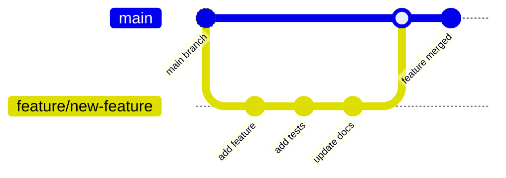
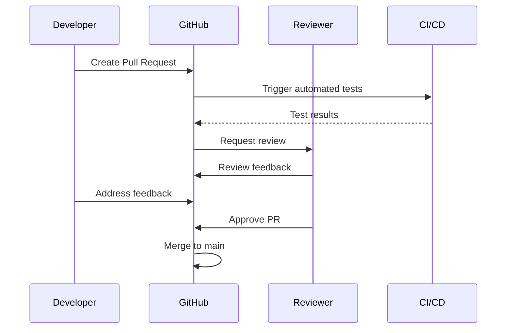

# Contributing to Roommate

We love your input! We want to make contributing to Roommate as easy and transparent as possible, whether it's:

- Reporting a bug
- Discussing the current state of the code
- Submitting a fix
- Proposing new features
- Becoming a maintainer

## 🎯 Development Process

We use GitHub to host code, to track issues and feature requests, as well as accept pull requests.

### Our Workflow



## 🚀 Getting Started

### Prerequisites

Ensure you have the following installed:
- **Flutter** ≥3.5.0
- **Bun** (preferred) or **Node.js** ≥18
- **Python** ≥3.8 (for fine-tuning)
- **Docker** (optional, for containerized development)
- **Git**

### Setting Up Your Development Environment

1. **Fork and clone the repository**
   ```bash
   git clone https://github.com/YOUR_USERNAME/roommate.git
   cd roommate
   ```

2. **Install dependencies**
   ```bash
   # Install all dependencies automatically
   ./scripts/check_dependencies.sh
   
   # Or manually:
   cd mongodb && bun install
   cd ../server && bun install
   cd ../app && flutter pub get
   cd ../fine-tuning && pip install -r requirements.txt
   ```

3. **Set up pre-commit hooks** (optional but recommended)
   ```bash
   # Install pre-commit
   pip install pre-commit
   pre-commit install
   ```

4. **Start development services**
   ```bash
   # Option 1: Docker development environment
   docker-compose -f docker-compose.dev.yml up -d
   
   # Option 2: Manual development setup
   # Terminal 1: MongoDB (optional)
   docker run -d -p 27017:27017 mongo
   
   # Terminal 2: Backend server with hot reload
   cd server && bun run --watch index.ts
   
   # Terminal 3: Flutter in development mode
   cd app && flutter run -d chrome --hot
   ```

## 🎨 Code Style and Standards

### TypeScript/JavaScript (Server & MongoDB Handler)

- Use **TypeScript** for all new code
- Follow the existing code style (similar to Airbnb style guide)
- Use **Bun** as the primary runtime
- Prefer `async/await` over Promises
- Use meaningful variable and function names

```typescript
// ✅ Good
async function saveUserMemory(userId: string, message: string): Promise<void> {
  try {
    await mongoHandler.saveMemory(userId, message);
  } catch (error) {
    captureError(error);
    throw new Error('Failed to save user memory');
  }
}

// ❌ Avoid
function save(u, m) {
  mongoHandler.saveMemory(u, m).catch(e => console.log(e));
}
```

### Dart/Flutter (Mobile App)

- Follow [Dart Style Guide](https://dart.dev/guides/language/effective-dart)
- Use `flutter_lints` (already configured)
- Prefer composition over inheritance
- Use meaningful widget names
- Add comments for complex UI logic

```dart
// ✅ Good
class ChatMessage extends StatelessWidget {
  const ChatMessage({
    super.key,
    required this.text,
    required this.isUser,
    this.timestamp,
  });

  final String text;
  final bool isUser;
  final DateTime? timestamp;

  @override
  Widget build(BuildContext context) {
    return Container(
      // Implementation
    );
  }
}
```

### Python (Fine-tuning)

- Follow [PEP 8](https://pep8.org/)
- Use type hints
- Use descriptive function and variable names
- Add docstrings for functions and classes

```python
# ✅ Good
def format_training_example(example: Dict[str, Any]) -> Optional[Dict[str, List[int]]]:
    """Format a training example for model fine-tuning.
    
    Args:
        example: Dictionary containing 'prompt' and optionally 'ideal' keys
        
    Returns:
        Formatted example with input_ids and labels, or None if invalid
    """
    if not example.get("ideal"):
        return None
    
    return {
        "input_ids": tokenizer(example["prompt"]).input_ids,
        "labels": tokenizer(example["ideal"]).input_ids,
    }
```

## 🧪 Testing

### Running Tests

```bash
# Run all tests
./run-tests.sh

# Run specific component tests
cd server && bun test
cd mongodb && bun test
cd app && flutter test
cd fine-tuning && python -m pytest

# Run tests with coverage
cd server && bun test --coverage
cd app && flutter test --coverage
cd fine-tuning && python -m pytest --cov=.
```

### Writing Tests

#### Backend Tests (Jest)
```typescript
describe('Memory API', () => {
  test('should save user memory correctly', async () => {
    const mockMemory = { userId: 'test-user', message: 'My dog is Max' };
    
    const response = await request(app)
      .post('/memory/save')
      .send(mockMemory)
      .expect(200);
    
    expect(response.body.success).toBe(true);
  });
});
```

#### Flutter Tests
```dart
void main() {
  group('Chat Widget Tests', () {
    testWidgets('should display message correctly', (tester) async {
      const message = ChatMessage(text: 'Hello', isUser: true);
      
      await tester.pumpWidget(
        MaterialApp(home: Scaffold(body: message)),
      );
      
      expect(find.text('Hello'), findsOneWidget);
      expect(find.byType(ChatMessage), findsOneWidget);
    });
  });
}
```

#### Python Tests (Pytest)
```python
def test_format_example_with_valid_data():
    """Test formatting example with valid training data."""
    example = {"prompt": "Hello", "ideal": "Hi there!"}
    result = format_example(example)
    
    assert result is not None
    assert "input_ids" in result
    assert "labels" in result
```

## 📋 Pull Request Process

### Before Submitting

1. **Create a feature branch**
   ```bash
   git checkout -b feature/your-feature-name
   ```

2. **Make your changes**
   - Write clean, documented code
   - Add tests for new functionality
   - Update documentation if needed

3. **Run the full test suite**
   ```bash
   ./run-tests.sh
   ```

4. **Lint your code**
   ```bash
   # TypeScript/JavaScript
   cd server && bun run lint
   
   # Flutter/Dart
   cd app && flutter analyze
   
   # Python
   cd fine-tuning && flake8 . && black --check .
   ```

### Submitting Your PR

1. **Push your branch**
   ```bash
   git push origin feature/your-feature-name
   ```

2. **Create a Pull Request** with:
   - Clear title describing the change
   - Detailed description of what was changed and why
   - Link to any related issues
   - Screenshots for UI changes
   - Test results

3. **PR Template** (automatically applied):
   ```markdown
   ## Changes Made
   - [ ] Feature/bug description
   - [ ] Tests added/updated
   - [ ] Documentation updated
   
   ## Testing
   - [ ] All tests pass
   - [ ] Manual testing completed
   
   ## Screenshots (if applicable)
   [Add screenshots of UI changes]
   
   Fixes #[issue-number]
   ```

### Code Review Process



- **Automated checks**: Tests, linting, security scans
- **Manual review**: Code quality, architecture, documentation
- **At least one approval** required from maintainers
- **All conversations resolved** before merging

## 🐛 Bug Reports

Use our [bug report template](.github/ISSUE_TEMPLATE/bug_report.md):

**Great Bug Reports** tend to have:

- A quick summary and/or background
- Steps to reproduce (be specific!)
- What you expected would happen
- What actually happens
- Notes (possibly including why you think this might be happening)

## 💡 Feature Requests

Use our [feature request template](.github/ISSUE_TEMPLATE/feature_request.md):

**Great Feature Requests** include:

- Clear problem description
- Proposed solution
- Alternative solutions considered
- Additional context (mockups, examples)

## 🏗️ Architecture Guidelines

### Adding New Features

When adding significant features, consider:

1. **Component isolation** - Keep features modular
2. **Backward compatibility** - Don't break existing APIs
3. **Error handling** - Graceful degradation
4. **Testing** - Comprehensive test coverage
5. **Documentation** - Update relevant docs

### Database Changes

For MongoDB schema changes:
1. **Migration scripts** in `mongodb/migrations/`
2. **Version compatibility** with existing data
3. **Indexes** for performance
4. **Test with production-like data**

### API Changes

For server API modifications:
1. **Version your APIs** (`/v1/`, `/v2/`)
2. **Maintain backward compatibility**
3. **Update OpenAPI documentation**
4. **Add integration tests**

## 📊 Performance Guidelines

- **Profile before optimizing** - Use built-in tools
- **Memory efficiency** - Especially important for Flutter
- **Database queries** - Optimize MongoDB operations
- **Bundle size** - Keep Flutter web builds reasonable
- **Server response times** - Target <200ms for API calls

## 🔒 Security Guidelines

- **Never commit secrets** - Use environment variables
- **Validate all inputs** - Both client and server side
- **Use HTTPS** in production
- **Regular dependency updates** - Check for vulnerabilities
- **Follow OWASP guidelines** for web security

## 📝 Documentation

- **Code comments** for complex logic
- **README updates** for new features
- **API documentation** in `docs/api-reference.md`
- **Jupyter notebooks** for tutorials
- **Inline documentation** for public APIs

## 🎯 Coding Best Practices

### Error Handling

```typescript
// ✅ Good - Comprehensive error handling
async function processUserMessage(message: string): Promise<string> {
  try {
    const result = await aiService.generateResponse(message);
    return result;
  } catch (error) {
    // Log error for debugging
    captureError(error);
    
    // Return user-friendly message
    return "I'm having trouble processing that right now. Please try again.";
  }
}
```

### Memory Management

```dart
// ✅ Good - Proper disposal
class ChatController extends ChangeNotifier {
  late StreamSubscription _subscription;
  
  @override
  void dispose() {
    _subscription.cancel();
    super.dispose();
  }
}
```

### Configuration

```typescript
// ✅ Good - Environment-based configuration
const config = {
  mongodb: {
    uri: process.env.MONGODB_URI || 'mongodb://localhost:27017/roommate',
    options: { maxPoolSize: 10 }
  },
  server: {
    port: parseInt(process.env.PORT || '8080'),
    cors: process.env.NODE_ENV !== 'production'
  }
};
```

## 🤝 Community

- **Be respectful** - Follow our [Code of Conduct](CODE_OF_CONDUCT.md)
- **Help others** - Answer questions in issues and discussions
- **Share knowledge** - Write blog posts, tutorials
- **Give feedback** - Participate in feature discussions

## 📞 Getting Help

- 📖 Check the [documentation](docs/)
- 🔍 Search [existing issues](https://github.com/TheusHen/roommate/issues)
- 💬 Start a [discussion](https://github.com/TheusHen/roommate/discussions)
- 🐛 Create a [new issue](https://github.com/TheusHen/roommate/issues/new)

## 🏆 Recognition

Contributors will be:
- Listed in our [Contributors](https://github.com/TheusHen/roommate/graphs/contributors) page
- Mentioned in release notes for significant contributions
- Given appropriate credit in documentation

Thank you for making Roommate better! 🎉