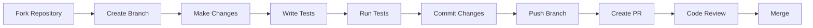

# Contributing to Roommate

Thank you for your interest in contributing to Roommate! This document provides guidelines and information for contributors.

## 🤝 Welcome

We're excited to have you contribute to Roommate! Whether you're fixing bugs, adding features, improving documentation, or helping with testing, your contributions are valuable to the community.

## 📋 Table of Contents

- [Code of Conduct](#code-of-conduct)
- [Getting Started](#getting-started)
- [Development Environment](#development-environment)
- [Contributing Process](#contributing-process)
- [Coding Standards](#coding-standards)
- [Testing Guidelines](#testing-guidelines)
- [Pull Request Process](#pull-request-process)
- [Issue Reporting](#issue-reporting)
- [Documentation](#documentation)
- [Community](#community)

## 📜 Code of Conduct

This project adheres to the Contributor Covenant [Code of Conduct](CODE_OF_CONDUCT.md). By participating, you are expected to uphold this code. Please report unacceptable behavior to [conduct@roommate-ai.com](mailto:conduct@roommate-ai.com).

## 🚀 Getting Started

### Prerequisites

Before contributing, ensure you have:

- Git installed and configured
- Basic knowledge of the technologies used:
  - **Flutter/Dart** for mobile app development
  - **TypeScript/Bun** for server-side development
  - **MongoDB** for database operations
  - **Shell scripting** for automation scripts

### First-Time Setup

1. **Fork the Repository**
   ```bash
   # Fork on GitHub, then clone your fork
   git clone https://github.com/YOUR_USERNAME/roommate.git
   cd roommate
   ```

2. **Add Upstream Remote**
   ```bash
   git remote add upstream https://github.com/TheusHen/roommate.git
   ```

3. **Install Dependencies**
   ```bash
   # Use the automated setup
   ./scripts/start/run.sh
   # Or manually install components
   ./scripts/check_dependencies.sh
   ```

4. **Verify Installation**
   ```bash
   # Run tests to ensure everything works
   ./run-tests.sh
   ```

## 🛠️ Development Environment

### Project Structure

```
roommate/
├── app/                    # Flutter application
├── server/                # Bun/TypeScript server
├── mongodb/               # Memory system
├── scripts/               # Automation scripts
├── docs/                  # Documentation
└── tests/                 # Integration tests
```

### Environment Setup

1. **Flutter Development**
   ```bash
   cd app
   flutter pub get
   flutter run  # For development
   ```

2. **Server Development**
   ```bash
   cd server
   bun install
   bun run index.ts  # Start development server
   ```

3. **MongoDB Development**
   ```bash
   cd mongodb
   bun install
   bun test  # Run memory system tests
   ```

### Development Tools

- **VS Code** with Flutter and TypeScript extensions (recommended)
- **Android Studio** for Android development
- **Xcode** for iOS development (macOS only)
- **Docker** for containerized testing

## 🔄 Contributing Process

### Workflow Overview



### Step-by-Step Process

1. **Create a Feature Branch**
   ```bash
   git checkout -b feature/your-feature-name
   # or
   git checkout -b fix/issue-number-description
   ```

2. **Make Your Changes**
   - Follow the coding standards
   - Add tests for new functionality
   - Update documentation as needed

3. **Test Your Changes**
   ```bash
   # Run full test suite
   ./run-tests.sh
   
   # Test specific components
   cd server && bun test
   cd ../app && flutter test
   cd ../mongodb && bun test
   ```

4. **Commit Your Changes**
   ```bash
   git add .
   git commit -m "type: description of changes"
   ```

5. **Keep Your Branch Updated**
   ```bash
   git fetch upstream
   git rebase upstream/main
   ```

6. **Push and Create Pull Request**
   ```bash
   git push origin feature/your-feature-name
   # Then create PR on GitHub
   ```

## 📏 Coding Standards

### General Principles

- **Clarity over cleverness**: Write code that's easy to understand
- **Consistency**: Follow existing code patterns
- **Documentation**: Comment complex logic and public APIs
- **Testing**: Write tests for new functionality

### Language-Specific Guidelines

#### TypeScript/JavaScript (Server)

```typescript
// Use meaningful variable names
const userMemoryHandler = new MongoDBHandler();

// Add type annotations
interface UserMemory {
  type: string;
  key: string;
  value: string;
  timestamp: string;
  userId: string;
}

// Use async/await for promises
async function saveUserMemory(userId: string, sentence: string): Promise<void> {
  try {
    await mongoHandler.saveMemory(userId, sentence);
  } catch (error) {
    console.error('Failed to save memory:', error);
    throw error;
  }
}
```

#### Dart/Flutter (App)

```dart
// Use descriptive class names
class UserMemoryService {
  // Add documentation comments
  /// Retrieves user memories relevant to the given prompt
  Future<List<UserMemory>> getRelevantMemories(
    String userId, 
    String prompt,
  ) async {
    try {
      final response = await http.get(
        Uri.parse('$baseUrl/memory/get?userId=$userId&prompt=$prompt'),
      );
      // Handle response...
    } catch (e) {
      debugPrint('Error fetching memories: $e');
      rethrow;
    }
  }
}
```

#### Shell Scripts

```bash
#!/bin/bash
set -e  # Exit on error

# Use descriptive function names
install_dependencies() {
    local component="$1"
    echo "[INFO] Installing $component dependencies..."
    
    # Check if command exists before running
    if command -v npm >/dev/null 2>&1; then
        npm install
    else
        echo "[ERROR] npm not found. Please install Node.js first."
        exit 1
    fi
}
```

### Code Formatting

- **TypeScript**: Use Prettier with 2-space indentation
- **Dart**: Use `dart format` (included in Flutter)
- **Shell**: Use 4-space indentation, quote variables

## 🧪 Testing Guidelines

### Test Structure

- **Unit Tests**: Test individual functions/components
- **Integration Tests**: Test component interactions
- **End-to-End Tests**: Test complete user workflows

### Writing Tests

#### Server Tests (Jest/Bun)

```typescript
// server/index.test.ts
describe('Memory API', () => {
  test('should save user memory', async () => {
    const response = await fetch('/memory/save', {
      method: 'POST',
      body: JSON.stringify({
        userId: 'test-user',
        sentence: 'My cat is named Fluffy'
      })
    });
    
    expect(response.status).toBe(200);
  });
});
```

#### Flutter Tests

```dart
// app/test/memory_service_test.dart
void main() {
  group('UserMemoryService', () {
    test('should retrieve relevant memories', () async {
      final service = UserMemoryService();
      final memories = await service.getRelevantMemories(
        'test-user', 
        'What pets do I have?'
      );
      
      expect(memories, isNotEmpty);
    });
  });
}
```

### Test Coverage

- Aim for >80% code coverage on new features
- Always test error conditions
- Include edge cases in your tests

### Running Tests

```bash
# Full test suite
./run-tests.sh

# Component-specific tests
cd server && bun test
cd ../app && flutter test
cd ../mongodb && bun test

# With coverage
cd server && bun test --coverage
cd ../app && flutter test --coverage
```

## 📤 Pull Request Process

### Before Submitting

- [ ] Code follows style guidelines
- [ ] Tests pass locally
- [ ] Documentation is updated
- [ ] Commit messages follow conventions
- [ ] Branch is up to date with main

### PR Template

When creating a pull request, include:

```markdown
## Description
Brief description of changes

## Type of Change
- [ ] Bug fix
- [ ] New feature
- [ ] Documentation update
- [ ] Performance improvement
- [ ] Code refactoring

## Testing
- [ ] Unit tests pass
- [ ] Integration tests pass
- [ ] Manual testing completed

## Checklist
- [ ] Code follows style guidelines
- [ ] Self-review completed
- [ ] Documentation updated
- [ ] Tests added/updated
```

### Review Process

1. **Automated Checks**: CI/CD pipeline runs tests
2. **Code Review**: Maintainers review code
3. **Feedback**: Address review comments
4. **Approval**: At least one maintainer approval required
5. **Merge**: Squash and merge to main branch

## 🐛 Issue Reporting

### Before Creating an Issue

1. **Search existing issues** to avoid duplicates
2. **Check FAQ** in docs/faq.md
3. **Try latest version** to see if issue persists

### Bug Report Template

```markdown
## Bug Description
Clear description of the bug

## Steps to Reproduce
1. Step one
2. Step two
3. Step three

## Expected Behavior
What should happen

## Actual Behavior
What actually happens

## Environment
- OS: [e.g., Ubuntu 22.04]
- Flutter Version: [e.g., 3.5.0]
- Bun Version: [e.g., 1.0.0]
- Browser: [if applicable]

## Additional Context
Screenshots, logs, or other relevant information
```

### Feature Request Template

```markdown
## Feature Description
Clear description of the proposed feature

## Use Case
Why is this feature needed?

## Proposed Solution
How should this feature work?

## Alternatives Considered
Other solutions you've considered

## Additional Context
Mockups, examples, or references
```

## 📚 Documentation

### Documentation Standards

- **Clear and Concise**: Use simple language
- **Examples**: Include code examples where relevant
- **Up-to-Date**: Keep documentation synchronized with code
- **Accessible**: Consider different skill levels

### Documentation Types

1. **Code Comments**
   ```typescript
   /**
    * Extracts user information from a sentence using pattern recognition
    * @param sentence The user's input sentence
    * @returns Extracted information objects
    */
   ```

2. **README Files**
   - Project overview
   - Quick start guide
   - Basic usage examples

3. **API Documentation**
   - Endpoint descriptions
   - Request/response examples
   - Error codes

4. **Tutorials**
   - Step-by-step guides
   - Jupyter notebooks for demos
   - Video walkthroughs

### Documentation Workflow

1. **Write Documentation**: Create or update docs with your changes
2. **Review**: Ensure accuracy and clarity
3. **Test**: Verify examples work correctly
4. **Submit**: Include documentation changes in your PR

## 👥 Community

### Communication Channels

- **GitHub Issues**: Bug reports and feature requests
- **GitHub Discussions**: General questions and ideas
- **Discord**: Real-time chat (coming soon)
- **Email**: [team@roommate-ai.com](mailto:team@roommate-ai.com)

### Getting Help

1. **Documentation**: Check docs/ folder first
2. **FAQ**: Review docs/faq.md
3. **Issues**: Search existing GitHub issues
4. **Discussions**: Ask in GitHub Discussions
5. **Community**: Join Discord for real-time help

### Mentorship

New contributors are welcome! We offer:

- **Good First Issues**: Labeled for beginners
- **Mentorship**: Guidance from experienced contributors
- **Pair Programming**: Available for complex features
- **Code Reviews**: Learning opportunity through feedback

## 🎯 Contribution Ideas

### Areas Needing Help

- **Mobile Platforms**: iOS and Android improvements
- **Voice Recognition**: Multi-language support
- **Memory System**: Advanced pattern recognition
- **Documentation**: Tutorials and examples
- **Testing**: Automated test coverage
- **Performance**: Optimization and benchmarking
- **Security**: Penetration testing and fixes

### Beginner-Friendly Tasks

- Fix typos in documentation
- Add unit tests for existing functions
- Improve error messages
- Add code comments
- Update dependencies
- Write examples and tutorials

### Advanced Tasks

- Implement new memory pattern types
- Add voice recognition languages
- Optimize database queries
- Implement real-time features
- Add machine learning capabilities
- Integrate new AI models

## 📊 Recognition

Contributors are recognized through:

- **Contributors File**: Listed in CONTRIBUTORS.md
- **Release Notes**: Acknowledged in releases
- **GitHub Profile**: Contribution graph and stats
- **Hall of Fame**: Featured on project website

## 📞 Contact

- **Maintainers**: [maintainers@roommate-ai.com](mailto:maintainers@roommate-ai.com)
- **Security Issues**: [security@roommate-ai.com](mailto:security@roommate-ai.com)
- **General Questions**: [team@roommate-ai.com](mailto:team@roommate-ai.com)

---

Thank you for contributing to Roommate! Your efforts help make this project better for everyone. 🚀