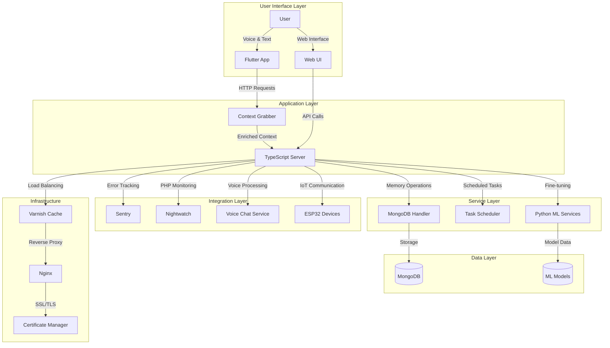
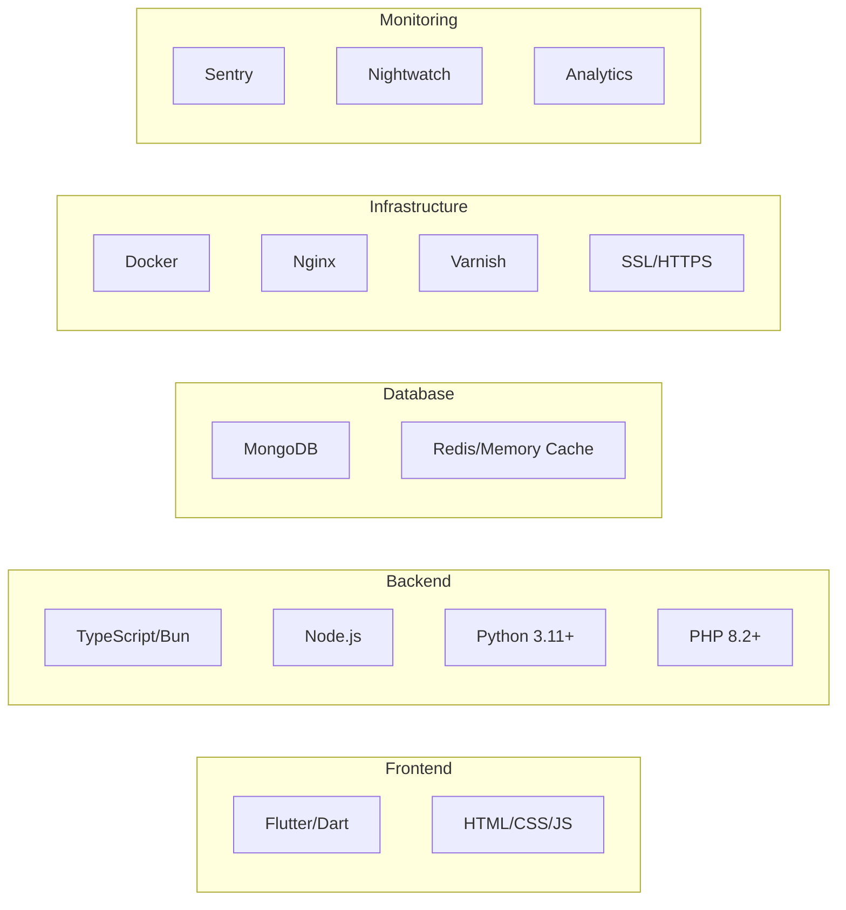

# Roommate Project


Roommate is a modular, cross-platform intelligent assistant and chat system designed for smart environments. It integrates advanced user memory capabilities, contextual conversation enrichment, multi-language support, and comprehensive IoT integrations. Built with modern technologies across multiple platforms, Roommate offers a seamless experience for smart home automation, personal assistance, and interactive communication.

## ✨ Key Features

- 🧠 **Intelligent Memory System** - Persistent user context and conversation memory (MongoDB + TypeScript)
- 📱 **Cross-Platform App** - Flutter-based mobile and desktop application with voice support
- 🔗 **Context Enrichment** - Smart conversation enhancement using stored user preferences and history
- 🌐 **Multi-Language Server** - TypeScript-based backend with comprehensive API endpoints
- 🤖 **AI Fine-tuning** - Python-based model training and analytics capabilities
- 🎙️ **Voice Integration** - Real-time voice chat and interaction
- 📅 **Task Scheduling** - Automated background tasks and notifications
- 📊 **Error Tracking** - Comprehensive monitoring with Sentry and Nightwatch
- 🏠 **IoT Support** - ESP32 and smart device integration
- 🐳 **Docker Ready** - Full containerization support for easy deployment
- 🔒 **Security** - SSL/HTTPS support with certificate management

## 🏗️ Project Architecture



## 🛠️ Technology Stack



## 🚀 Quick Start

### Option 1: Automatic Setup (Recommended)
Start the entire system with one command:
```bash
./scripts/start/run.sh
```

This script will:
- ✅ Check and install all dependencies automatically
- ✅ Configure SSL certificates (HTTPS mode)
- ✅ Start all services in the correct order
- ✅ Set up monitoring and error tracking
- ✅ Provide deployment options (Local/HTTP/HTTPS)

### Option 2: Docker Setup (Cross-Platform)
Perfect for Windows users or containerized environments:
```bash
./scripts/start/docker_run.sh
```

This will:
- ✅ Install Docker if needed
- ✅ Build and start all containers
- ✅ Set up networking and volumes
- ✅ Provide unified service access

### Option 3: Manual Installation
For developers who need granular control:
```bash
# Check system dependencies
./scripts/check_dependencies.sh

# See detailed setup instructions
# Visit: docs/advanced_installation.md
```

## 💻 Usage Examples

### Basic Operations
```bash
# Start the complete system
./scripts/start/run.sh

# Run comprehensive tests
./run-tests.sh

# Validate system health
./scripts/validate_fixes.sh

# Check system requirements
./scripts/check_dependencies.sh
```

### API Interactions
```bash
# Memory operations
curl -X POST http://localhost:3000/memory/save \
  -H "Content-Type: application/json" \
  -d '{"userId": "user123", "sentence": "My favorite color is blue"}'

# Chat with context
curl -X POST http://localhost:3000/chat \
  -H "Content-Type: application/json" \
  -d '{"message": "What is my favorite color?", "userId": "user123"}'
```

### Development Workflow
```bash
# Install dependencies for specific modules
cd server && npm install
cd ../app && flutter pub get
cd ../mongodb && bun install

# Run individual test suites
cd server && npm test
cd ../app && flutter test
cd ../mongodb && bun test
```

## 📚 Documentation

Comprehensive documentation is available in the `docs/` directory:

- **[📖 Advanced Installation Guide](docs/advanced_installation.md)** - Detailed setup instructions and troubleshooting
- **[🔌 API Reference](docs/api_reference.md)** - Complete API documentation with examples
- **[🧪 Testing Guide](docs/testing.md)** - Testing procedures and CI/CD information
- **[❓ FAQ](docs/faq.md)** - Frequently asked questions and common issues
- **[📓 Tutorials](docs/tutorials.ipynb)** - Interactive Jupyter notebook tutorials
- **[🏗️ Architecture Guide](docs/architecture.ipynb)** - Deep dive into system design
- **[🔧 Development Guide](docs/development.ipynb)** - Contributing and development workflows

## 🤝 Contributing

We welcome contributions from the community! Please read our contribution guidelines:

**[📋 CONTRIBUTING.md](CONTRIBUTING.md)** - Complete guide including:
- How to contribute code, documentation, and bug reports
- Coding standards for all languages (TypeScript, Dart, Python, PHP)
- Pull request process and review guidelines
- Testing requirements and procedures
- Development environment setup

**[🌟 CODE_OF_CONDUCT.md](CODE_OF_CONDUCT.md)** - Our community standards

### Quick Contribution Steps
1. Fork the repository
2. Create a feature branch: `git checkout -b feature/amazing-feature`
3. Make your changes and add tests
4. Run the test suite: `./run-tests.sh`
5. Commit your changes: `git commit -m 'Add amazing feature'`
6. Push to the branch: `git push origin feature/amazing-feature`
7. Open a Pull Request

## 🔧 System Requirements

### Minimum Requirements
- **Python**: 3.11+
- **Node.js**: 20+
- **Bun**: Latest
- **Flutter**: 3.24+
- **PHP**: 8.2+
- **MongoDB**: 6.0+
- **Docker**: 20.10+ (optional)

### Platform Support
- ✅ **Linux** (Ubuntu 20.04+, CentOS 8+, Debian 11+)
- ✅ **macOS** (10.15+)
- ✅ **Windows** (10/11, via Docker recommended)
- ✅ **Mobile** (Android 8+, iOS 12+)
- ✅ **IoT** (ESP32, Raspberry Pi)

## 🌟 Project Highlights

### Advanced Memory System
- Intelligent pattern recognition for user information extraction
- Contextual memory retrieval based on conversation flow
- Persistent storage with MongoDB for scalability
- Real-time memory integration with chat responses

### Cross-Platform Excellence
- Flutter application supporting mobile, desktop, and web
- Responsive web interface for browser-based access
- Native performance across all supported platforms
- Consistent UI/UX design language

### Enterprise-Ready Infrastructure
- Load balancing with Varnish cache
- Reverse proxy configuration with Nginx
- SSL/HTTPS support with automatic certificate management
- Comprehensive error tracking and monitoring
- CI/CD pipeline integration ready

### Developer Experience
- Comprehensive test coverage across all modules
- Multiple deployment options (local, Docker, production)
- Extensive documentation with interactive tutorials
- Modular architecture for easy customization
- Active community support

## 📊 Project Status


## 📞 Support & Community

- **Issues**: [GitHub Issues](https://github.com/TheusHen/roommate/issues)
- **Discussions**: [GitHub Discussions](https://github.com/TheusHen/roommate/discussions)
- **Wiki**: [Project Wiki](https://github.com/TheusHen/roommate/wiki)

## 📜 License

This project is licensed under the **AGPL-3.0 License** - see the [LICENSE](LICENSE) file for details.

---

**Built with ❤️ by the Roommate community**
