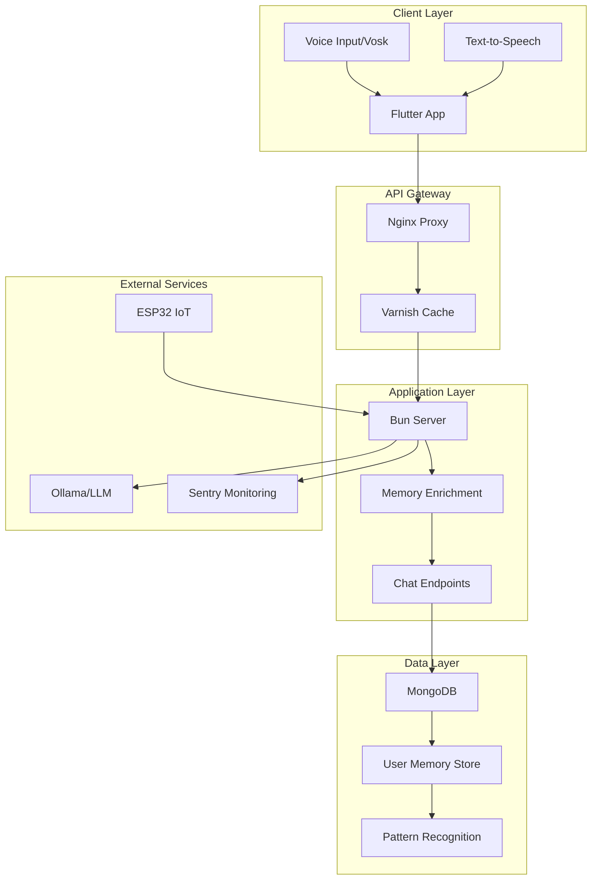

# Roommate - AI-Powered Chat Assistant


Roommate is an advanced AI-powered chat assistant that combines multi-platform deployment, voice recognition, user memory capabilities, and intelligent conversation enhancement. It's designed to be your helpful digital roommate that remembers your preferences and provides personalized interactions.

## ✨ Features

- 🗣️ **Voice Chat**: Real-time speech recognition using Vosk models (English & Portuguese)
- 🧠 **User Memory**: Intelligent pattern recognition to remember user preferences, pets, locations, and personal information
- 📱 **Cross-Platform**: Flutter app supporting mobile, desktop, and web platforms
- 🐳 **Containerized Deployment**: Docker support with automated setup
- 🔒 **Secure**: SSL/HTTPS support with automated certificate management
- 📊 **Monitoring**: Integrated error tracking with Sentry and Nightwatch
- 🌐 **Production Ready**: Nginx proxy, Varnish caching, and load balancing
- 🎯 **IoT Integration**: ESP32 support for physical room integration

## 🏗️ Architecture



## 🚀 Quick Start

### Option 1: Automated Setup (Recommended)

```bash
# Clone the repository
git clone https://github.com/TheusHen/roommate.git
cd roommate

# Run everything automatically
./scripts/start/run.sh
```

The script will guide you through deployment mode selection:
- **HTTPS (Recommended)**: Production deployment with SSL certificates
- **HTTP**: Local network deployment without SSL
- **Local**: Development mode on localhost only

### Option 2: Docker Deployment

```bash
# For Docker deployment
./scripts/start/docker_run.sh
```

## 📋 System Requirements

### Minimum Requirements
- **OS**: Linux (Ubuntu 20.04+), macOS 10.15+, or Windows 10+
- **RAM**: 4GB minimum, 8GB recommended
- **Storage**: 10GB free space
- **Network**: Internet connection for initial setup

### Dependencies (Auto-installed)
- Python 3.8+
- Node.js 18+
- Bun 1.0+
- PHP 8.0+ (for Nightwatch testing)
- Nginx
- Docker (optional)
- MongoDB (optional, auto-configured)

## 📖 Installation Guide

### 1. Prerequisites Check
```bash
# The setup script automatically checks and installs dependencies
chmod +x scripts/check_dependencies.sh
./scripts/check_dependencies.sh
```

### 2. Environment Configuration
```bash
# Set up environment variables
python3 config/set_env.py

# Configure analytics (optional)
python3 config/analytics.py
```

### 3. Development Setup
```bash
# Install Flutter dependencies
cd app && flutter pub get

# Install server dependencies  
cd ../server && bun install

# Install MongoDB handler dependencies
cd ../mongodb && bun install
```

### 4. Production Deployment
```bash
# For HTTPS deployment with SSL
./scripts/start/run.sh
# Select option 1 (HTTPS) and provide your domain name
```

## 🎯 Usage Examples

### Basic Chat Interaction
```dart
// Flutter app automatically connects to the server
// Users can type or speak to interact with the AI
```

### Voice Commands
```bash
# Users can speak naturally:
"My dog's name is Duke, remember that"
"I live in New York" 
"What's my dog's name?" # → "Your dog's name is Duke"
```

### Memory System
The system automatically recognizes and stores:
- **Pet Information**: Names and details about pets
- **Location Data**: Home location and places lived
- **Work Information**: Company and job details
- **Personal Details**: Name and biographical information
- **Preferences**: Likes, dislikes, and interests

### API Endpoints
```bash
# Save user memory
POST /memory/save
{
  "userId": "user123",
  "sentence": "My cat is named Whiskers"
}

# Retrieve relevant memories
GET /memory/get?userId=user123&prompt=What%20pets%20do%20I%20have

# Enhanced chat with memory context
POST /chat
{
  "prompt": "Tell me about cats",
  "userId": "user123"
}
```

## 🛠️ Development

### Running Tests
```bash
# Run all tests
./run-tests.sh

# Test specific components
cd server && bun test
cd ../app && flutter test
cd ../mongodb && bun test
```

### Development Mode
```bash
# Start in development mode
cd server && bun run index.ts

# Run Flutter app in debug mode
cd app && flutter run
```

### Adding New Features
1. Fork the repository
2. Create a feature branch
3. Implement changes with tests
4. Submit a pull request

See [CONTRIBUTING.md](CONTRIBUTING.md) for detailed guidelines.

## 📁 Project Structure

```
roommate/
├── app/                    # Flutter application
│   ├── lib/
│   │   ├── main.dart      # App entry point
│   │   ├── pages/         # UI screens
│   │   ├── grabber/       # Memory integration
│   │   └── utils/         # Utility functions
│   └── test/              # Flutter tests
├── server/                # Bun/TypeScript server
│   ├── index.ts          # Server entry point
│   └── package.json      # Server dependencies
├── mongodb/               # Memory system
│   ├── index.ts          # MongoDB handler
│   └── index.test.ts     # Memory tests
├── scripts/               # Automation scripts
│   ├── start/            # Startup scripts
│   ├── install/          # Dependency installers
│   └── check_dependencies.sh
├── config/                # Configuration
├── nginx/                 # Web server config
├── nightwatch/           # Testing framework
├── sentry/               # Error tracking
├── esp32/                # IoT integration
└── docs/                 # Documentation
```

## 🔧 Configuration

### Environment Variables
```bash
# Server configuration
MONGODB_URI=mongodb://localhost:27017/roommate
OLLAMA_API_URL=http://localhost:11434
SENTRY_DSN=your_sentry_dsn

# Security
API_PASSWORD=auto_generated_password

# Analytics (optional)
ANALYTICS_OPTION=sentry
```

### SSL Configuration
For HTTPS deployment, the system automatically:
1. Installs Certbot
2. Generates SSL certificates via Let's Encrypt
3. Configures Nginx with HTTPS
4. Sets up automatic certificate renewal

## 🚨 Troubleshooting

### Common Issues

**Port Conflicts**
```bash
# Check if ports are in use
sudo netstat -tlnp | grep :80
sudo netstat -tlnp | grep :3000
```

**MongoDB Connection Issues**
```bash
# Start MongoDB manually
docker run -d -p 27017:27017 mongo

# Check MongoDB status
docker ps | grep mongo
```

**SSL Certificate Problems**
```bash
# Verify domain DNS
nslookup your-domain.com

# Check certificate status
sudo certbot certificates
```

**Flutter Build Issues**
```bash
# Clean and rebuild
cd app
flutter clean
flutter pub get
flutter build linux  # or your target platform
```

## 📚 Documentation

- [Installation Guide](docs/installation.md) - Detailed setup instructions
- [Architecture Guide](docs/architecture.md) - System design and components
- [API Reference](docs/api-reference.md) - Server endpoints and usage
- [Memory System](docs/memory-system.md) - User memory capabilities
- [Voice Integration](docs/voice-integration.md) - Speech recognition setup
- [Deployment Guide](docs/deployment.md) - Production deployment
- [FAQ](docs/faq.md) - Frequently asked questions

### Tutorials
- [Getting Started Notebook](docs/tutorials/getting-started.ipynb)
- [Memory System Demo](docs/tutorials/memory-system-demo.ipynb)
- [Voice Chat Setup](docs/tutorials/voice-chat-tutorial.ipynb)

## 🤝 Contributing

We welcome contributions! Please see our [Contributing Guidelines](CONTRIBUTING.md) and [Code of Conduct](CODE_OF_CONDUCT.md).

### Quick Contribution Steps
1. Fork the repository
2. Create a feature branch: `git checkout -b feature-name`
3. Make your changes with tests
4. Run the test suite: `./run-tests.sh`
5. Submit a pull request

## 📄 License

This project is licensed under the GNU General Public License v3.0 - see the [LICENSE](LICENSE) file for details.

## 🙏 Acknowledgments

- [Flutter](https://flutter.dev/) - Cross-platform UI framework
- [Bun](https://bun.sh/) - Fast JavaScript runtime
- [Vosk](https://alphacephei.com/vosk/) - Speech recognition
- [MongoDB](https://www.mongodb.com/) - Database
- [Ollama](https://ollama.ai/) - Local LLM inference
- [Nginx](https://nginx.org/) - Web server
- [Let's Encrypt](https://letsencrypt.org/) - SSL certificates

## 📞 Support

- 🐛 [Report Issues](https://github.com/TheusHen/roommate/issues)
- 💬 [Discussions](https://github.com/TheusHen/roommate/discussions)
- 📧 [Contact](mailto:support@roommate-ai.com)

---

<div align="center">
Made with ❤️ by the Roommate team
</div>