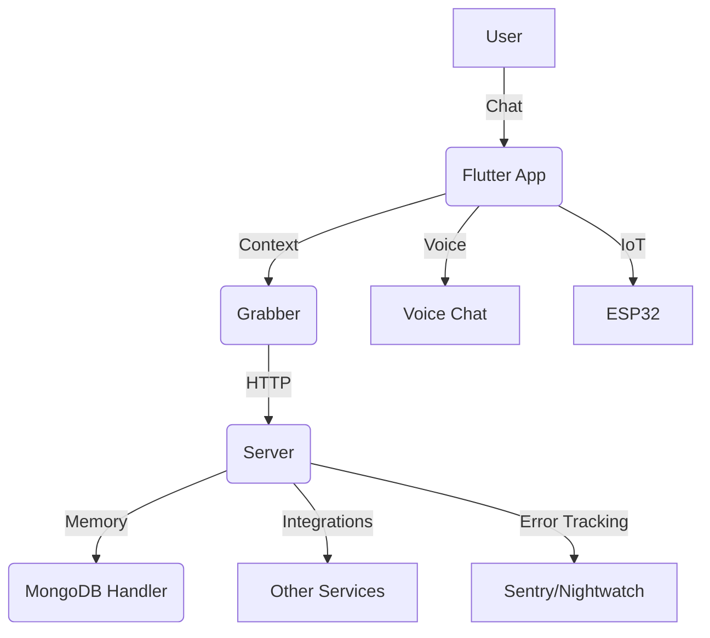

# Roommate Project


Roommate is a modular, cross-platform assistant and chat system designed for smart environments, integrating memory, context enrichment, and multi-language support. It features:
- **User memory system** (MongoDB, TypeScript)
- **Context grabber** (Flutter/Dart)
- **Server integration** (TypeScript)
- **Fine-tuning & analytics** (Python)
- **Voice chat, scheduled tasks, error tracking, and IoT/ESP32 support**

## Project Architecture



## Installation

### Automatic (Recommended)
Run everything with one command:
```sh
./scripts/start/run.sh
```

### Docker (Alternative)
Run in Docker (Windows supported):
```sh
./scripts/start/docker_run.sh
```

### Manual Setup
See [docs/advanced_installation.md](docs/advanced_installation.md) for details.

## Usage Examples
- **Start the app:** `./scripts/start/run.sh`
- **Run tests:** `./run-tests.sh`
- **Access web UI:** Open `web/index.html`
- **API endpoints:** See [docs/api_reference.md](docs/api_reference.md)

## Contribution
See [CONTRIBUTING.md](CONTRIBUTING.md) for coding standards, PR process, and testing.

## Documentation
- [docs/](docs/) — Tutorials, guides, FAQs, and notebooks

## Quick Links
- [Advanced Installation](docs/advanced_installation.md)
- [API Reference](docs/api_reference.md)
- [FAQ](docs/faq.md)
- [Tutorials](docs/tutorials.ipynb)
