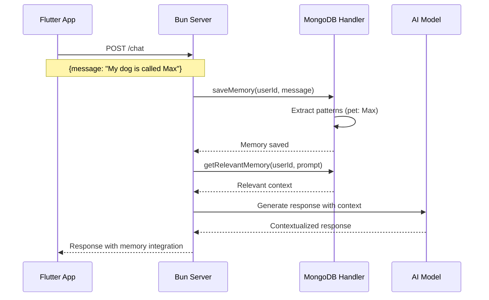

# 🏠 Roommate - AI Chat Assistant

An intelligent chat application that acts as your digital roommate, complete with memory capabilities, voice interaction, and multi-platform support. Built with Flutter, TypeScript, and MongoDB for a seamless conversational experience.

## 🎯 Project Overview

Roommate is a sophisticated AI chat assistant that remembers personal information across conversations, making interactions feel natural and personalized. The system combines pattern recognition, user memory storage, and intelligent context building to create meaningful dialogue experiences.

### ✨ Key Features

- 🧠 **Smart Memory System** - Remembers pets, preferences, work info, and personal details
- 🗣️ **Voice Chat** - Natural speech interaction with TTS and voice recognition
- 📱 **Cross-Platform** - Flutter app runs on iOS, Android, Windows, macOS, and Web
- 🔄 **Real-time Chat** - Instant messaging with context-aware responses
- 🎯 **Pattern Recognition** - Automatically extracts and stores user information
- 🔧 **Model Fine-tuning** - Custom AI model training capabilities
- 📊 **Analytics & Monitoring** - Comprehensive error tracking and performance metrics
- 🔒 **Secure** - API authentication and privacy-focused design

## 🏗️ Architecture



```mermaid
graph TB
    subgraph "Frontend Layer"
        A[Flutter App]
        A1[Chat Interface]
        A2[Voice Chat]
        A3[Settings]
    end
    
    subgraph "Backend Services"
        B[Bun/TypeScript Server]
        B1[Chat API]
        B2[Memory API]
        B3[Auth System]
    end
    
    subgraph "Data Layer"
        C[MongoDB Handler]
        C1[Memory Storage]
        C2[Pattern Recognition]
        C3[Context Retrieval]
    end
    
    subgraph "AI/ML Layer"
        D[Fine-tuning System]
        D1[Model Training]
        D2[Custom Datasets]
        D3[LoRA Adapters]
    end
    
    subgraph "Infrastructure"
        E[Docker Services]
        E1[Nginx Proxy]
        E2[Varnish Cache]
        E3[MongoDB]
    end
    
    subgraph "Monitoring"
        F[Analytics Stack]
        F1[Sentry Error Tracking]
        F2[Nightwatch Monitoring]
        F3[Scheduled Tasks]
    end
    
    subgraph "Hardware (Future)"
        G[ESP32 Integration]
        G1[IoT Sensors]
        G2[Room Automation]
    end
    
    A --> B
    B --> C
    B --> D
    B --> F
    E --> B
    E --> C
    G -.-> B
    
    A1 --> B1
    A2 --> B1
    B1 --> C1
    B2 --> C2
    B3 --> F1
```

## 🚀 Quick Start

### Prerequisites

- **Flutter** (≥3.5.0) for mobile/desktop app
- **Bun** or **Node.js** for backend services
- **Python** (≥3.8) for fine-tuning (optional)
- **Docker** for containerized deployment (optional)
- **MongoDB** for memory storage (optional, graceful fallback)

### Installation

1. **Clone the repository**
   ```bash
   git clone https://github.com/TheusHen/roommate.git
   cd roommate
   ```

2. **Install dependencies**
   ```bash
   # Check and install all dependencies
   ./scripts/check_dependencies.sh
   
   # Or install manually:
   cd mongodb && bun install
   cd ../server && bun install  
   cd ../app && flutter pub get
   ```

3. **Start services**
   ```bash
   # Option 1: Docker (recommended)
   docker-compose up -d
   
   # Option 2: Manual
   # Terminal 1: Start MongoDB (optional)
   docker run -d -p 27017:27017 mongo
   
   # Terminal 2: Start server
   cd server && bun run index.ts
   
   # Terminal 3: Run Flutter app
   cd app && flutter run
   ```

4. **Access the application**
   - Flutter app will launch automatically
   - Web version available at `http://localhost:3000`
   - API available at `http://localhost:8080`

## 💬 Usage Examples

### Basic Chat Interaction
```typescript
// The system automatically learns from conversations
User: "My dog's name is Max and I work at Google"
Roommate: "Nice to meet Max! How long have you been working at Google?"

// Later conversation - context is remembered
User: "What's my dog's name?"
Roommate: "Your dog's name is Max! How is he doing?"
```

### Memory System Patterns
The system recognizes and stores:
- **Pet Information**: "My cat is called Whiskers"
- **Location Data**: "I live in San Francisco"  
- **Work Details**: "I'm employed by Microsoft"
- **Personal Info**: "My name is Alice"
- **Preferences**: "I love hiking and pizza"

### Voice Chat
```dart
// Flutter integration
import 'package:app/pages/voice_chat.dart';

// Voice chat automatically integrates with memory system
// Spoken: "Tell me about my preferences"
// Response: Spoken summary of stored preferences
```

## 🛠️ Development

### Project Structure
```
roommate/
├── app/                    # Flutter mobile/desktop app
│   ├── lib/pages/         # UI pages (chat, voice, settings)
│   ├── lib/grabber/       # Memory integration service
│   └── test/              # Flutter tests
├── server/                # Bun/TypeScript backend
│   ├── index.ts           # Main server with API endpoints
│   └── index.test.ts      # Server tests
├── mongodb/               # Memory storage handler
│   ├── index.ts           # MongoDB operations & pattern recognition
│   └── index.test.ts      # Memory system tests
├── fine-tuning/           # AI model training
│   ├── fine.py            # LoRA fine-tuning script
│   └── test_fine.py       # Training tests
├── esp32/                 # Hardware integration (coming soon)
├── docs/                  # Documentation and tutorials
├── scripts/               # Utility and installation scripts
└── docker-compose.yml     # Container orchestration
```

### API Endpoints



#### Core Endpoints
- `POST /chat` - Send message, get AI response with memory
- `POST /memory/save` - Manually save user information  
- `GET /memory/get` - Retrieve relevant memories
- `GET /api-password` - Get authentication token

### Running Tests
```bash
# Run all tests
./run-tests.sh

# Individual component tests
cd server && bun test
cd mongodb && bun test  
cd app && flutter test
cd fine-tuning && python -m pytest
```

### Building for Production
```bash
# Flutter app
cd app && flutter build apk --release     # Android
cd app && flutter build ios --release     # iOS  
cd app && flutter build web --release     # Web
cd app && flutter build windows --release # Windows

# Server (containerized)
docker build -t roommate-server .
```

## 🤝 Contributing

We welcome contributions! Please see our [Contributing Guide](CONTRIBUTING.md) for details on:
- Development setup
- Code style and standards  
- Pull request process
- Testing requirements

## 📚 Documentation

Comprehensive guides available in the [`docs/`](docs/) folder:
- [Installation Guide](docs/installation.md) - Detailed setup instructions
- [API Reference](docs/api-reference.md) - Complete API documentation
- [Architecture Deep Dive](docs/architecture.md) - System design details
- [Development Guide](docs/development.md) - Contributing and development workflow
- [User Guide](docs/user-guide.md) - End-user documentation
- [Tutorial Notebooks](docs/tutorials/) - Interactive Jupyter notebooks

## 🔧 Configuration

### Environment Variables
```bash
# Optional - MongoDB connection
MONGODB_URI=mongodb://localhost:27017/roommate

# Optional - Error tracking
SENTRY_DSN=your_sentry_dsn_here
NIGHTWATCH_API_URL=your_monitoring_url

# Generated automatically
API_PASSWORD=auto_generated_secure_password
```

### Analytics Options
Configure in `config/analytics_config.json`:
```json
{
  "analytics": "Sentry + Nightwatch"  // Options: "None", "Sentry", "Nightwatch", "Sentry + Nightwatch"
}
```

## 📄 License

This project is licensed under the GNU Affero General Public License v3.0 - see the [LICENSE](LICENSE) file for details.

## 🌟 Roadmap

- [x] Core chat functionality with memory
- [x] Flutter multi-platform support
- [x] Voice chat integration
- [x] Model fine-tuning system
- [x] Monitoring and analytics
- [ ] ESP32 hardware integration
- [ ] Advanced context understanding
- [ ] Multi-user support
- [ ] Plugin system
- [ ] Enhanced voice commands

## 🙋‍♂️ Support

- 📖 Check the [documentation](docs/)
- 🐛 Report bugs via [GitHub Issues](https://github.com/TheusHen/roommate/issues)
- 💬 Join discussions in [GitHub Discussions](https://github.com/TheusHen/roommate/discussions)
- 📧 Contact: [Create an issue](https://github.com/TheusHen/roommate/issues/new) for support

---

<div align="center">
<b>Built with ❤️ for better AI conversations</b><br>
<i>Making AI assistants more personal and memory-aware</i>
</div>