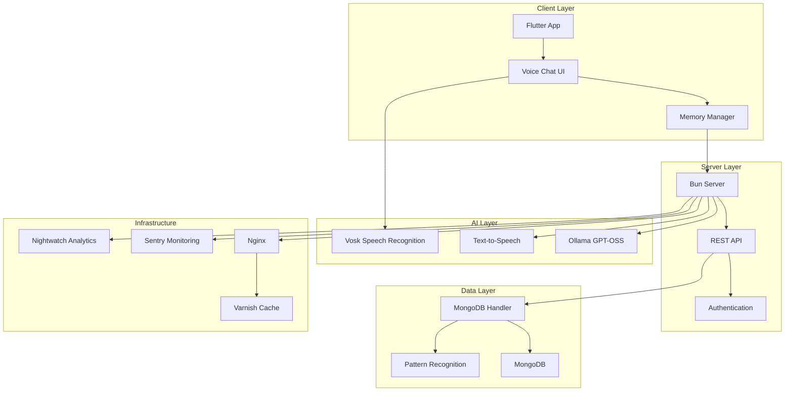
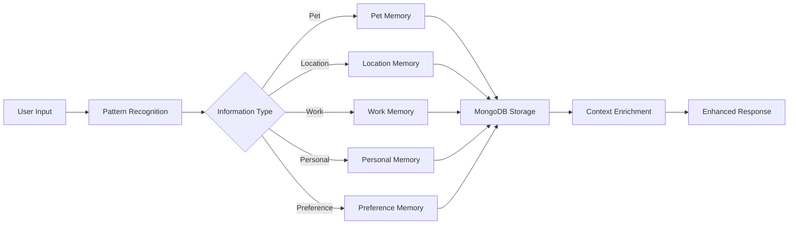

# Roommate - AI-Powered Voice Assistant

[](https://www.gnu.org/licenses/gpl-3.0)
[](https://flutter.dev)
[](https://bun.sh)
[](https://mongodb.com)

Roommate is a sophisticated AI-powered voice assistant that remembers your conversations and provides personalized responses. Built with Flutter for cross-platform mobile support, Bun.js for high-performance server operations, and MongoDB for intelligent memory management.

## ✨ Features

- **🎤 Voice Chat**: Offline speech recognition using Vosk with support for English and Portuguese
- **🧠 Memory System**: Intelligent user information storage and retrieval with pattern recognition
- **🌐 Multi-Language**: Seamless switching between English and Portuguese
- **🔊 Text-to-Speech**: Natural voice responses
- **📱 Cross-Platform**: Flutter app for Android, iOS, and desktop
- **🚀 High Performance**: Bun.js server with Ollama GPT-OSS integration
- **🔒 Secure**: Password-protected API with comprehensive error tracking
- **📊 Analytics**: Integrated Sentry and Nightwatch monitoring
- **🐳 Docker Ready**: Complete containerization support

## 🏗️ Architecture



## 🚀 Quick Start

### Option 1: Automatic Setup (Recommended)

```bash
# Clone the repository
git clone https://github.com/TheusHen/roommate.git
cd roommate

# Run everything automatically
./scripts/start/run.sh
```

### Option 2: Docker Setup

```bash
# Clone the repository
git clone https://github.com/TheusHen/roommate.git
cd roommate

# Start with Docker
./scripts/start/docker_run.sh
```

### Option 3: Manual Setup

```bash
# Clone the repository
git clone https://github.com/TheusHen/roommate.git
cd roommate

# Install dependencies
cd mongodb && bun install
cd ../server && bun install
cd ../app && flutter pub get

# Start MongoDB (optional)
docker run -d -p 27017:27017 mongo

# Start the server
cd server && bun run index.ts

# Run the Flutter app
cd ../app && flutter run
```

## 📋 Prerequisites

- **Bun** >= 1.0.0 ([Installation Guide](https://bun.sh/docs/installation))
- **Flutter** >= 3.5.0 ([Installation Guide](https://docs.flutter.dev/get-started/install))
- **Docker** (for MongoDB and containerized deployment)
- **Ollama** with GPT-OSS model ([Installation Guide](https://ollama.ai))

## 💾 Memory System

Roommate features an intelligent memory system that learns from conversations:



### Supported Memory Types

- **Pet Information**: Names and details about pets
- **Location Data**: Home location, places lived
- **Work Information**: Company, job details
- **Personal Details**: Name, biographical information
- **Preferences**: Likes, dislikes, interests

## 🛠️ Development

### Project Structure

```
roommate/
├── app/                    # Flutter mobile application
│   ├── lib/
│   │   ├── pages/         # UI screens
│   │   ├── grabber/       # Memory integration
│   │   └── utils/         # Utilities and helpers
│   └── test/              # Flutter tests
├── server/                # Bun.js server
│   ├── index.ts          # Main server file
│   └── package.json      # Server dependencies
├── mongodb/               # MongoDB handler module
│   ├── index.ts          # Memory management logic
│   └── index.test.ts     # Memory tests
├── scripts/               # Deployment and utility scripts
│   ├── start/            # Startup scripts
│   └── install/          # Installation scripts
├── nginx/                # Nginx configuration
├── nightwatch/           # Analytics module
├── sentry/               # Error tracking
├── fine-tuning/          # Model training
└── docs/                 # Documentation
```

### Running Tests

```bash
# Run all tests
./run-tests.sh

# Run specific component tests
cd server && bun test
cd ../app && flutter test
cd ../mongodb && bun test
```

### Development Mode

```bash
# Start in local development mode
./scripts/start/run.sh
# Select option 3 (Local)
```

## 🌐 API Endpoints

The server provides several REST endpoints:

- `POST /chat` - Send chat messages with memory enrichment
- `POST /memory/save` - Store user information
- `POST /memory/get` - Retrieve relevant memories
- `POST /feedback` - Submit feedback for model improvement
- `GET /ping` - Health check endpoint

## 🔧 Configuration

### Environment Variables

```bash
# Optional MongoDB connection
MONGO_URI=mongodb://localhost:27017

# Analytics (Sentry)
SENTRY_DSN=your_sentry_dsn

# Analytics (Nightwatch)
NIGHTWATCH_API_URL=your_nightwatch_url
NIGHTWATCH_API_KEY=your_api_key
```

### Deployment Options

1. **HTTPS Mode**: Production deployment with SSL certificates
2. **HTTP Mode**: Standard HTTP deployment
3. **Local Mode**: Development mode (Bun server only)

## 📚 Documentation

For detailed documentation, visit the [docs](./docs/) folder:

- [Architecture Guide](./docs/architecture.md) - System design and component interaction
- [Installation Guide](./docs/installation.md) - Comprehensive setup instructions
- [API Documentation](./docs/api.md) - Complete API reference
- [Development Tutorial](./docs/development-tutorial.ipynb) - Interactive development guide
- [Voice Chat Tutorial](./docs/voice-chat-tutorial.ipynb) - Voice integration examples
- [Memory System Tutorial](./docs/memory-system-tutorial.ipynb) - User memory examples
- [FAQ](./docs/faq.md) - Common questions and troubleshooting

## 🤝 Contributing

We welcome contributions! Please see our [Contributing Guidelines](./CONTRIBUTING.md) for details on:

- Code standards and style
- Pull request process
- Testing requirements
- Development setup

## 📄 License

This project is licensed under the GNU General Public License v3.0 - see the [LICENSE](./LICENSE) file for details.

## 🆘 Support

- **Issues**: [GitHub Issues](https://github.com/TheusHen/roommate/issues)
- **Discussions**: [GitHub Discussions](https://github.com/TheusHen/roommate/discussions)
- **Documentation**: [docs/](./docs/)

## 🎯 Roadmap

- [x] Voice chat with offline recognition
- [x] User memory system
- [x] Multi-language support
- [x] MongoDB integration
- [x] Comprehensive testing
- [ ] ESP32 hardware integration
- [ ] Mobile platform optimization
- [ ] Advanced AI model fine-tuning
- [ ] Plugin system

---

<p align="center">Made with ❤️ by the Roommate team</p>