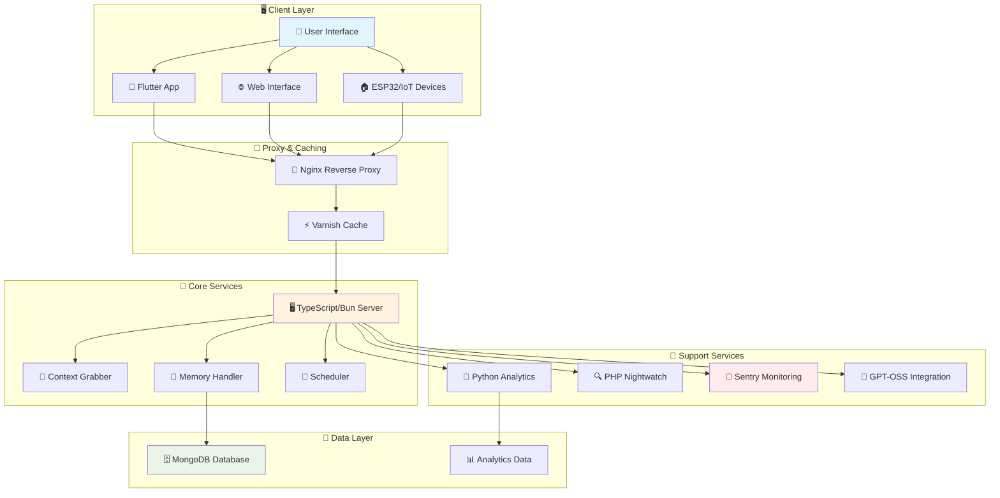
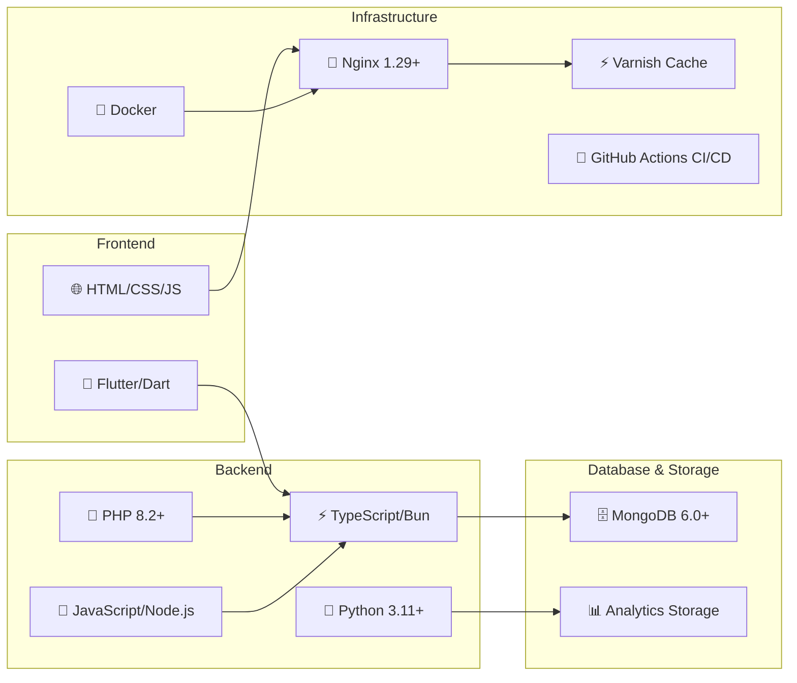

# Roommate Project


**Roommate** is a comprehensive, modular assistant and chat system designed for smart environments. It integrates advanced memory capabilities, context enrichment, multi-language support, voice interaction, IoT connectivity, and real-time monitoring to create an intelligent companion for modern digital environments.

## 🚀 Key Features

- **🧠 Intelligent Memory System**: Advanced user memory with MongoDB storage and context-aware retrieval
- **📱 Cross-Platform Mobile App**: Flutter-based application supporting Android, iOS, Web, and Desktop
- **🔌 Multi-Language Backend**: TypeScript/Bun server with Python analytics and PHP monitoring
- **🎤 Voice Interaction**: Real-time voice chat with TTS and speech recognition
- **🏠 IoT Integration**: ESP32 support for smart home automation
- **📊 Real-Time Analytics**: Comprehensive monitoring with Sentry error tracking and Nightwatch
- **⚡ High Performance**: Nginx reverse proxy with Varnish caching for optimal performance
- **🐳 Containerized Deployment**: Full Docker support with automated setup scripts

## 🏗️ System Architecture



## 🛠️ Technology Stack



## 📦 Installation

### 🎯 Quick Start (Recommended)

The fastest way to get Roommate running:

```bash
# Clone the repository
git clone https://github.com/TheusHen/roommate.git
cd roommate

# Run everything automatically
./scripts/start/run.sh
```

This script will:
- ✅ Check and install all dependencies
- ✅ Set up SSL certificates (HTTPS mode)
- ✅ Configure environment variables
- ✅ Start all services (MongoDB, Server, Analytics)
- ✅ Launch the web interface

### 🐳 Docker Deployment

For containerized deployment (Windows, macOS, Linux):

```bash
# Docker Compose (recommended)
docker-compose up -d

# Or use the Docker script
./scripts/start/docker_run.sh
```

### ⚙️ Manual Installation

For advanced users who want full control:

```bash
# Install dependencies
./scripts/check_dependencies.sh

# Manual setup
cd server && bun install
cd ../mongodb && bun install  
cd ../app && flutter pub get
cd ../nightwatch && composer install

# Start services individually
./scripts/start/run.sh
```

For detailed manual setup instructions, see [docs/advanced_installation.md](docs/advanced_installation.md).

## 🎮 Usage Examples

### Basic Chat Interaction
```bash
# Start the system
./scripts/start/run.sh

# Access web interface
open http://localhost:8080

# Or use the Flutter app
cd app && flutter run
```

### API Usage
```http
# Save user memory
POST /memory/save
Content-Type: application/json
{
  "userId": "user-123",
  "type": "preference",
  "key": "favorite_color",
  "value": "blue"
}

# Send chat message
POST /chat/send
Content-Type: application/json
{
  "message": "What's my favorite color?",
  "userId": "user-123"
}
```

### Testing the System
```bash
# Run all tests
./run-tests.sh

# Test specific components
cd server && bun test
cd mongodb && bun test
cd app && flutter test
```

## 📖 Documentation

### 📚 User Guides
- [📖 Getting Started](docs/getting_started.md)
- [🔧 Advanced Installation](docs/advanced_installation.md)
- [❓ FAQ](docs/faq.md)
- [🧪 Testing Guide](docs/testing.md)

### 👨‍💻 Developer Resources
- [📋 API Reference](docs/api_reference.md)
- [🏗️ Architecture Deep Dive](docs/architecture.md)
- [📓 Interactive Tutorials](docs/tutorials.ipynb)
- [🔍 Troubleshooting](docs/troubleshooting.md)

### 📝 Interactive Learning
- [💡 Basic Usage Tutorial](docs/basic_tutorial.ipynb)
- [🧠 Memory System Guide](docs/memory_tutorial.ipynb)
- [🏠 IoT Integration Examples](docs/iot_tutorial.ipynb)

## 🤝 Contributing

We welcome contributions! To get started:

1. **Fork the repository** and create your feature branch
2. **Follow our coding standards** (see [CONTRIBUTING.md](CONTRIBUTING.md))
3. **Add tests** for new functionality
4. **Submit a Pull Request** with a clear description

### Quick Contribution Checklist
- [ ] Read [CONTRIBUTING.md](CONTRIBUTING.md) and [CODE_OF_CONDUCT.md](CODE_OF_CONDUCT.md)
- [ ] Create feature branch from `main`
- [ ] Write tests for new features
- [ ] Ensure all tests pass: `./run-tests.sh`
- [ ] Follow commit message conventions
- [ ] Submit PR with detailed description

## 🛡️ Code of Conduct

This project adheres to the [Contributor Covenant Code of Conduct](CODE_OF_CONDUCT.md). By participating, you are expected to uphold this code. Please report unacceptable behavior to the project maintainers.

## 📄 License

This project is licensed under the [AGPL-3.0 License](LICENSE) - see the LICENSE file for details.

## 🔗 Quick Links

| Resource | Description |
|----------|-------------|
| [🏠 Home](https://github.com/TheusHen/roommate) | Main repository |
| [📖 Documentation](docs/) | Complete documentation |
| [🐛 Issues](https://github.com/TheusHen/roommate/issues) | Bug reports & feature requests |
| [💬 Discussions](https://github.com/TheusHen/roommate/discussions) | Community discussions |
| [🚀 Releases](https://github.com/TheusHen/roommate/releases) | Version releases |

## 🏷️ Project Status


---

**⭐ Star this repository if you find it useful!**
