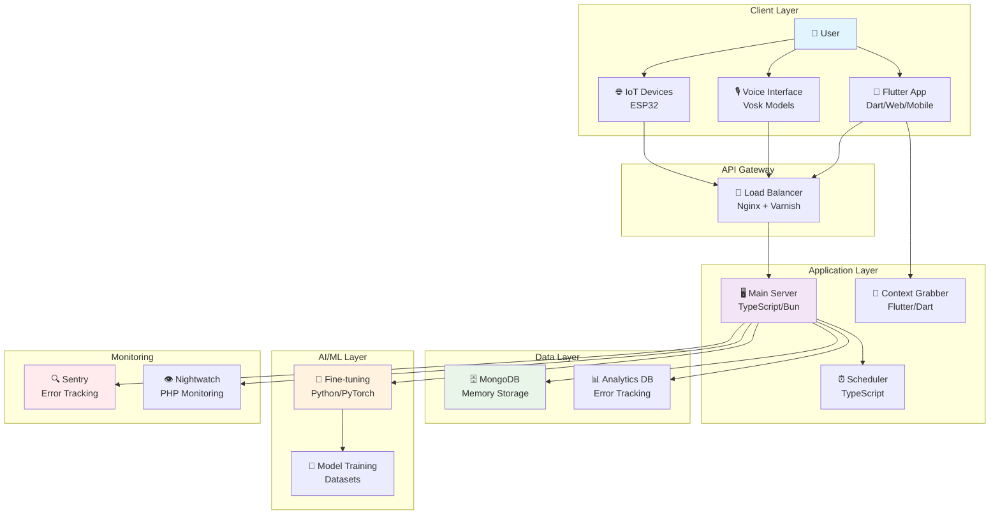
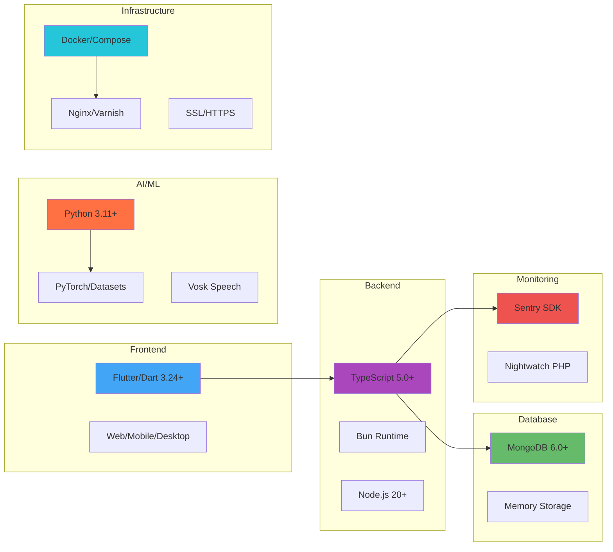
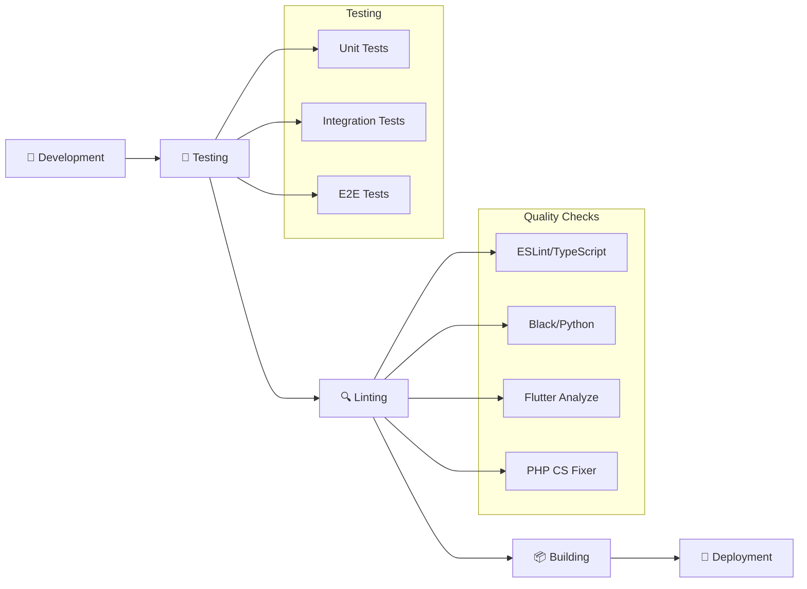

# Roommate Project


Roommate is a comprehensive, modular, and cross-platform assistant and chat system designed for smart environments. It integrates advanced memory management, context enrichment, voice processing, and multi-language support with robust error tracking and IoT capabilities.

## 🚀 Key Features

- **🧠 Advanced Memory System** - MongoDB-powered user memory storage and context retrieval
- **💬 Cross-Platform Chat** - Flutter-based UI supporting Web, Android, iOS, Linux, macOS, and Windows
- **🎙️ Voice Processing** - Real-time voice chat with Vosk speech recognition models
- **🔧 Modular Architecture** - TypeScript server with pluggable integrations
- **🤖 AI Fine-tuning** - Python-based machine learning model customization
- **📊 Error Tracking** - Dual monitoring with Sentry and Nightwatch
- **⏰ Scheduled Tasks** - Automated background processes
- **🌐 IoT Integration** - ESP32 and smart device connectivity
- **🐳 Docker Ready** - Full containerization support with Docker Compose
- **🔒 SSL/HTTPS** - Production-ready security configuration

## 🏗️ Project Architecture



## 🔧 Technology Stack



## 📦 Installation

### 🎯 Quick Start (Recommended)

Run everything automatically with one command:

```bash
./scripts/start/run.sh
```

**What this does:**
- ✅ Checks all dependencies
- ✅ Sets up SSL certificates (HTTPS mode)
- ✅ Configures Python virtual environment
- ✅ Runs analytics configuration
- ✅ Sets environment variables
- ✅ Installs all packages (Bun, Flutter, PHP)
- ✅ Starts all services
- ✅ Configures reverse proxy

### 🐳 Docker Installation (Windows/Cross-Platform)

For containerized deployment:

```bash
./scripts/start/docker_run.sh
```

**Benefits:**
- 🔄 Isolated environment
- 🌍 Cross-platform compatibility
- 📦 No dependency conflicts
- 🚀 One-command deployment

### ⚙️ Manual Installation

For development or custom setups, see [docs/advanced_installation.md](docs/advanced_installation.md).

## 💡 Usage Examples

### Basic Operations

```bash
# Start the complete system
./scripts/start/run.sh

# Run comprehensive tests
./run-tests.sh

# Check system dependencies
./scripts/check_dependencies.sh

# Validate installation
./scripts/validate_fixes.sh
```

### API Examples

```bash
# Save user memory
curl -X POST http://localhost:3000/memory/save \
  -H "Content-Type: application/json" \
  -d '{"userId": "user-123", "type": "preference", "key": "language", "value": "en"}'

# Retrieve chat history
curl -X GET http://localhost:3000/chat/history?userId=user-123

# Send chat message
curl -X POST http://localhost:3000/chat/send \
  -H "Content-Type: application/json" \
  -d '{"userId": "user-123", "message": "Hello Roommate!"}'
```

### Voice Chat Setup

```bash
# Access Flutter app voice features
cd app && flutter run

# Test voice recognition (requires Vosk models)
# Models automatically downloaded: vosk-model-small-en-us-0.15.zip
```

## 🔄 Development Workflow



## 🤝 Contributing

We welcome contributions! Please see [CONTRIBUTING.md](CONTRIBUTING.md) for:

- 📝 **Coding Standards** - TypeScript, Python, Dart, PHP guidelines
- 🔄 **Pull Request Process** - How to submit changes
- 🧪 **Testing Requirements** - Required test coverage
- 📚 **Documentation Guidelines** - How to document your code

Quick contribution workflow:
1. Fork the repository
2. Create a feature branch
3. Make your changes with tests
4. Run `./run-tests.sh`
5. Submit a pull request

## 📚 Documentation

### 📖 Guides & References
- [📋 Advanced Installation Guide](docs/advanced_installation.md)
- [🔌 API Reference](docs/api_reference.md)
- [❓ Frequently Asked Questions](docs/faq.md)
- [🧪 Testing Guide](docs/testing.md)

### 📓 Interactive Tutorials
- [🚀 Getting Started Notebook](docs/getting_started_tutorial.ipynb)
- [🧠 Memory System Tutorial](docs/memory_system_tutorial.ipynb)
- [🎙️ Voice Integration Guide](docs/voice_integration_tutorial.ipynb)
- [⚙️ Fine-tuning Tutorial](docs/fine_tuning_tutorial.ipynb)

### 🔗 Quick Reference Links
- [🏗️ Architecture Overview](docs/architecture_guide.md)
- [🔧 Deployment Guide](docs/deployment_guide.md)
- [🐛 Troubleshooting](docs/troubleshooting.md)
- [🔒 Security Guidelines](docs/security_guide.md)

## 🛡️ Error Tracking & Monitoring

Roommate includes comprehensive error tracking:

- **🔍 Sentry Integration** - Real-time error monitoring for TypeScript and Python
- **👁️ Nightwatch** - PHP-based monitoring and alerting
- **📊 Analytics** - User interaction and performance metrics
- **🚨 Automated Alerts** - Instant notification of critical issues

Configure monitoring during setup or run:
```bash
python3 ./config/analytics.py
```

## 📄 License

This project is licensed under the **AGPL-3.0 License** - see the [LICENSE](LICENSE) file for details.

## 🙏 Acknowledgments

- **Vosk** - Speech recognition models
- **Flutter Team** - Cross-platform framework
- **Bun** - Fast JavaScript runtime
- **MongoDB** - Document database
- **Sentry** - Error tracking platform

## 📞 Support & Community

- 🐛 **Issues**: [GitHub Issues](https://github.com/TheusHen/roommate/issues)
- 💬 **Discussions**: [GitHub Discussions](https://github.com/TheusHen/roommate/discussions)
- 📧 **Contact**: See [CODE_OF_CONDUCT.md](CODE_OF_CONDUCT.md) for maintainer contact
- 📖 **Wiki**: [Project Wiki](https://github.com/TheusHen/roommate/wiki)

---

<div align="center">

**⭐ Star this repository if you find it helpful!**

Made with ❤️ by the Roommate community

</div>
