# Roommate Architecture Deep Dive

This document provides a comprehensive overview of Roommate's architecture, including system design, component interactions, data flow, and deployment strategies.

## 🏗️ System Overview

Roommate is built as a modular, microservices-oriented system designed for scalability, maintainability, and cross-platform compatibility.

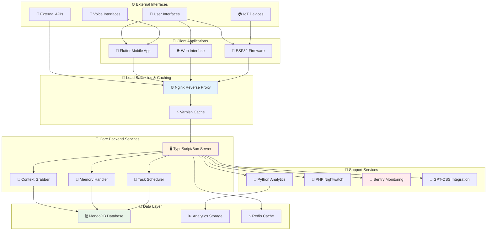
```mermaid
graph TB
    subgraph "🌐 External Interfaces"
        UI[👤 User Interfaces]
        API[🔌 External APIs]
        IOT[🏠 IoT Devices]
        VOICE[🎤 Voice Interfaces]
    end
    
    subgraph "🚀 Load Balancing & Caching"
        NGINX[🌐 Nginx Reverse Proxy]
        VARNISH[⚡ Varnish Cache]
    end
    
    subgraph "📱 Client Applications"
        FLUTTER[📱 Flutter Mobile App]
        WEB[🌐 Web Interface]
        ESP32[🔌 ESP32 Firmware]
    end
    
    subgraph "🎯 Core Backend Services"
        SERVER[🖥️ TypeScript/Bun Server]
        GRABBER[🧠 Context Grabber]
        MEMORY[📝 Memory Handler]
        SCHEDULER[📅 Task Scheduler]
    end
    
    subgraph "💾 Data Layer"
        MONGO[🗄️ MongoDB Database]
        ANALYTICS_DB[📊 Analytics Storage]
        CACHE_DB[⚡ Redis Cache]
    end
    
    subgraph "🔧 Support Services"
        PYTHON[🐍 Python Analytics]
        PHP[🐘 PHP Nightwatch]
        SENTRY[🚨 Sentry Monitoring]
        GPT[🤖 GPT-OSS Integration]
    end
    
    UI --> FLUTTER
    UI --> WEB
    UI --> ESP32
    API --> NGINX
    IOT --> ESP32
    VOICE --> FLUTTER
    
    FLUTTER --> NGINX
    WEB --> NGINX
    ESP32 --> NGINX
    
    NGINX --> VARNISH
    VARNISH --> SERVER
    
    SERVER --> GRABBER
    SERVER --> MEMORY
    SERVER --> SCHEDULER
    
    GRABBER --> MONGO
    MEMORY --> MONGO
    SCHEDULER --> MONGO
    
    SERVER --> PYTHON
    SERVER --> PHP
    SERVER --> SENTRY
    SERVER --> GPT
    
    PYTHON --> ANALYTICS_DB
    SERVER --> CACHE_DB
    
    style SERVER fill:#fff3e0
    style MONGO fill:#e8f5e8
    style NGINX fill:#e3f2fd
    style SENTRY fill:#ffebee
```

## 🧩 Core Components

### 1. Frontend Layer

#### Flutter Mobile Application
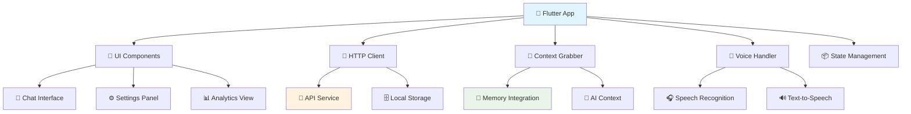
```mermaid
graph TD
    A[📱 Flutter App] --> B[🎨 UI Components]
    A --> C[🔌 HTTP Client]
    A --> D[🧠 Context Grabber]
    A --> E[🎤 Voice Handler]
    A --> F[📦 State Management]
    
    B --> G[💬 Chat Interface]
    B --> H[⚙️ Settings Panel]
    B --> I[📊 Analytics View]
    
    C --> J[🔌 API Service]
    C --> K[🗄️ Local Storage]
    
    D --> L[📝 Memory Integration]
    D --> M[🤖 AI Context]
    
    E --> N[🎧 Speech Recognition]
    E --> O[🔊 Text-to-Speech]
    
    style A fill:#e1f5fe
    style J fill:#fff3e0
    style L fill:#e8f5e8
```

**Technologies:**
- **Framework**: Flutter 3.24+ (Dart)
- **State Management**: Provider/Riverpod
- **HTTP Client**: Dio
- **Local Storage**: Hive/SQLite

### 2. Data Flow Architecture

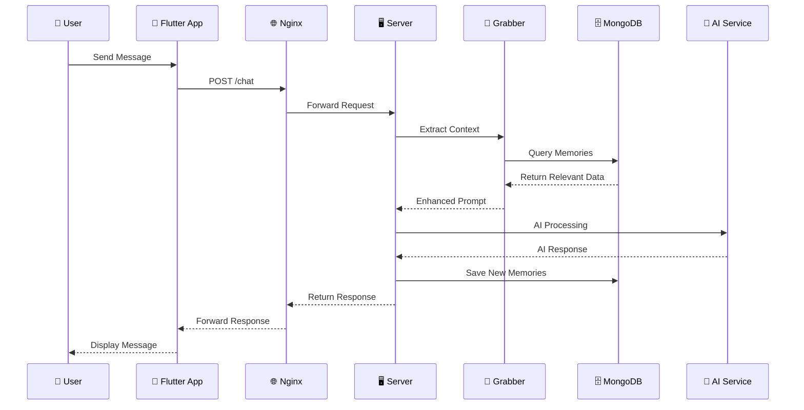
```mermaid
sequenceDiagram
    participant U as 👤 User
    participant F as 📱 Flutter App
    participant N as 🌐 Nginx
    participant S as 🖥️ Server
    participant G as 🧠 Grabber
    participant M as 🗄️ MongoDB
    participant A as 🤖 AI Service
    
    U->>F: Send Message
    F->>N: POST /chat
    N->>S: Forward Request
    S->>G: Extract Context
    G->>M: Query Memories
    M-->>G: Return Relevant Data
    G-->>S: Enhanced Prompt
    S->>A: AI Processing
    A-->>S: AI Response
    S->>M: Save New Memories
    S-->>N: Return Response
    N-->>F: Forward Response
    F-->>U: Display Message
```

### 3. Memory System Architecture

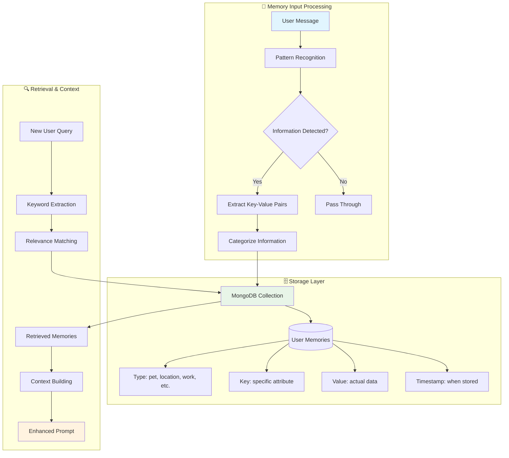
```mermaid
graph TB
    subgraph "📝 Memory Input Processing"
        A[User Message] --> B[Pattern Recognition]
        B --> C{Information Detected?}
        C -->|Yes| D[Extract Key-Value Pairs]
        C -->|No| E[Pass Through]
        D --> F[Categorize Information]
    end
    
    subgraph "🗄️ Storage Layer"
        F --> G[MongoDB Collection]
        G --> H[(User Memories)]
        H --> I[Type: pet, location, work, etc.]
        H --> J[Key: specific attribute]
        H --> K[Value: actual data]
        H --> L[Timestamp: when stored]
    end
    
    subgraph "🔍 Retrieval & Context"
        M[New User Query] --> N[Keyword Extraction]
        N --> O[Relevance Matching]
        O --> G
        G --> P[Retrieved Memories]
        P --> Q[Context Building]
        Q --> R[Enhanced Prompt]
    end
    
    style A fill:#e1f5fe
    style G fill:#e8f5e8
    style R fill:#fff3e0
```

### 4. IoT Integration Architecture

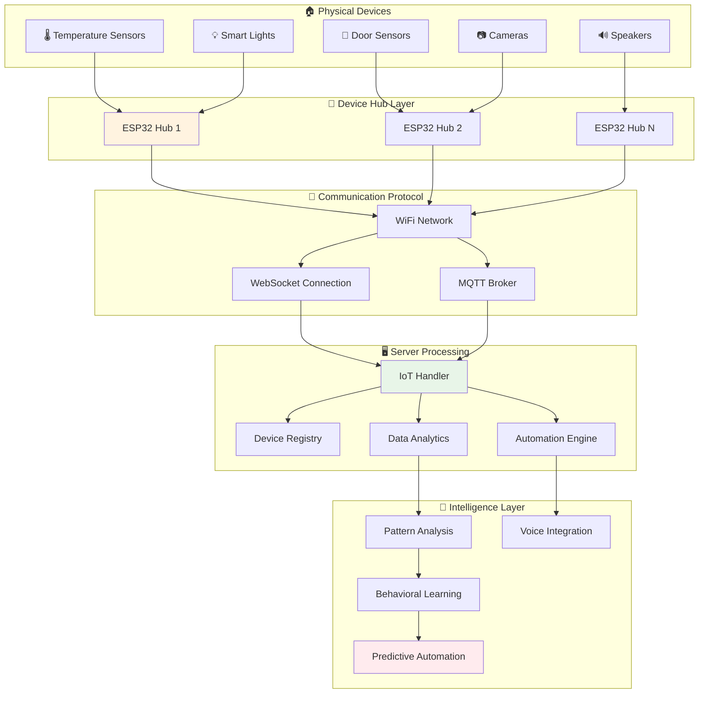
```mermaid
graph TB
    subgraph "🏠 Physical Devices"
        A[🌡️ Temperature Sensors]
        B[💡 Smart Lights]
        C[🚪 Door Sensors]
        D[📷 Cameras]
        E[🔊 Speakers]
    end
    
    subgraph "🔌 Device Hub Layer"
        F[ESP32 Hub 1]
        G[ESP32 Hub 2]
        H[ESP32 Hub N]
    end
    
    subgraph "📡 Communication Protocol"
        I[WiFi Network]
        J[WebSocket Connection]
        K[MQTT Broker]
    end
    
    subgraph "🖥️ Server Processing"
        L[IoT Handler]
        M[Device Registry]
        N[Automation Engine]
        O[Data Analytics]
    end
    
    subgraph "🤖 Intelligence Layer"
        P[Pattern Analysis]
        Q[Behavioral Learning]
        R[Predictive Automation]
        S[Voice Integration]
    end
    
    A --> F
    B --> F
    C --> G
    D --> G
    E --> H
    
    F --> I
    G --> I
    H --> I
    
    I --> J
    I --> K
    
    J --> L
    K --> L
    
    L --> M
    L --> N
    L --> O
    
    O --> P
    P --> Q
    Q --> R
    N --> S
    
    style F fill:#fff3e0
    style L fill:#e8f5e8
    style R fill:#ffebee
```

### 5. Security Architecture

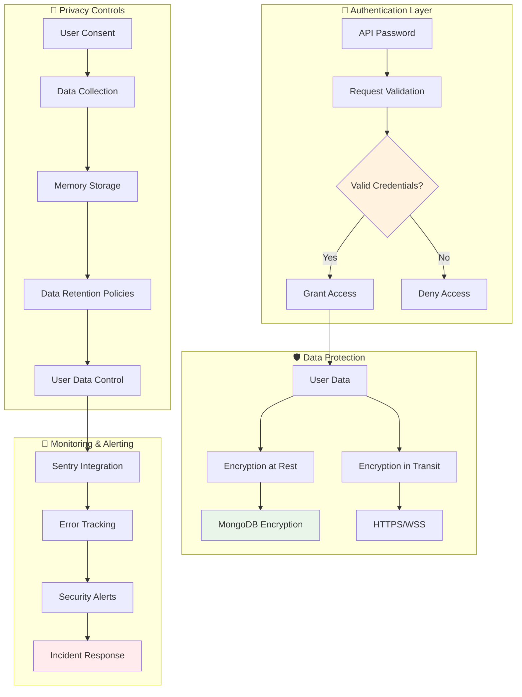
```mermaid
graph TD
    subgraph "🔐 Authentication Layer"
        A[API Password] --> B[Request Validation]
        B --> C{Valid Credentials?}
        C -->|Yes| D[Grant Access]
        C -->|No| E[Deny Access]
    end
    
    subgraph "🛡️ Data Protection"
        F[User Data] --> G[Encryption at Rest]
        G --> H[MongoDB Encryption]
        F --> I[Encryption in Transit]
        I --> J[HTTPS/WSS]
    end
    
    subgraph "👥 Privacy Controls"
        K[User Consent] --> L[Data Collection]
        L --> M[Memory Storage]
        M --> N[Data Retention Policies]
        N --> O[User Data Control]
    end
    
    subgraph "🚨 Monitoring & Alerting"
        P[Sentry Integration] --> Q[Error Tracking]
        Q --> R[Security Alerts]
        R --> S[Incident Response]
    end
    
    D --> F
    O --> P
    
    style C fill:#fff3e0
    style H fill:#e8f5e8
    style S fill:#ffebee
```

### 6. Deployment Architecture

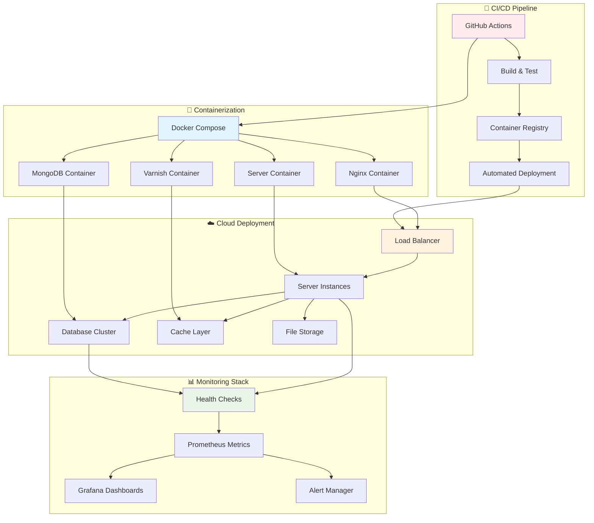
```mermaid
graph TB
    subgraph "🐳 Containerization"
        A[Docker Compose] --> B[Server Container]
        A --> C[MongoDB Container]
        A --> D[Nginx Container]
        A --> E[Varnish Container]
    end
    
    subgraph "☁️ Cloud Deployment"
        F[Load Balancer] --> G[Server Instances]
        G --> H[Database Cluster]
        G --> I[Cache Layer]
        G --> J[File Storage]
    end
    
    subgraph "📊 Monitoring Stack"
        K[Health Checks] --> L[Prometheus Metrics]
        L --> M[Grafana Dashboards]
        L --> N[Alert Manager]
    end
    
    subgraph "🔄 CI/CD Pipeline"
        O[GitHub Actions] --> P[Build & Test]
        P --> Q[Container Registry]
        Q --> R[Automated Deployment]
    end
    
    B --> G
    C --> H
    D --> F
    E --> I
    
    G --> K
    H --> K
    
    O --> A
    R --> F
    
    style A fill:#e1f5fe
    style F fill:#fff3e0
    style K fill:#e8f5e8
    style O fill:#ffebee
```
- **Voice**: speech_to_text, flutter_tts

#### Web Interface
- **Static Files**: HTML, CSS, JavaScript
- **Framework**: Vanilla JS (lightweight)
- **Features**: Chat interface, admin panel, monitoring dashboard

#### ESP32 IoT Integration
- **Language**: C++
- **Communication**: HTTP/MQTT
- **Features**: Sensor data collection, device control, voice commands

### 2. Backend Core Services

#### TypeScript/Bun Server
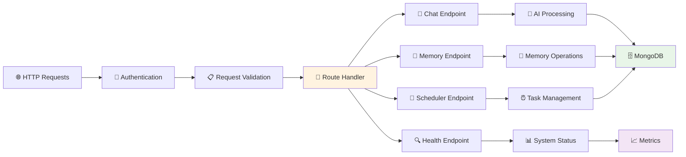
```mermaid
graph LR
    A[🌐 HTTP Requests] --> B[🔐 Authentication]
    B --> C[📋 Request Validation]
    C --> D[🎯 Route Handler]
    
    D --> E[💬 Chat Endpoint]
    D --> F[🧠 Memory Endpoint]
    D --> G[📅 Scheduler Endpoint]
    D --> H[🔍 Health Endpoint]
    
    E --> I[🤖 AI Processing]
    F --> J[📝 Memory Operations]
    G --> K[⏰ Task Management]
    H --> L[📊 System Status]
    
    I --> M[🗄️ MongoDB]
    J --> M
    K --> M
    L --> N[📈 Metrics]
    
    style D fill:#fff3e0
    style M fill:#e8f5e8
    style N fill:#f3e5f5
```

**Key Features:**
- **Runtime**: Bun (fast JavaScript runtime)
- **Language**: TypeScript
- **Framework**: Express.js
- **Authentication**: JWT tokens + API keys
- **Error Handling**: Sentry integration
- **Logging**: Structured JSON logging

#### Context Grabber (Memory System)
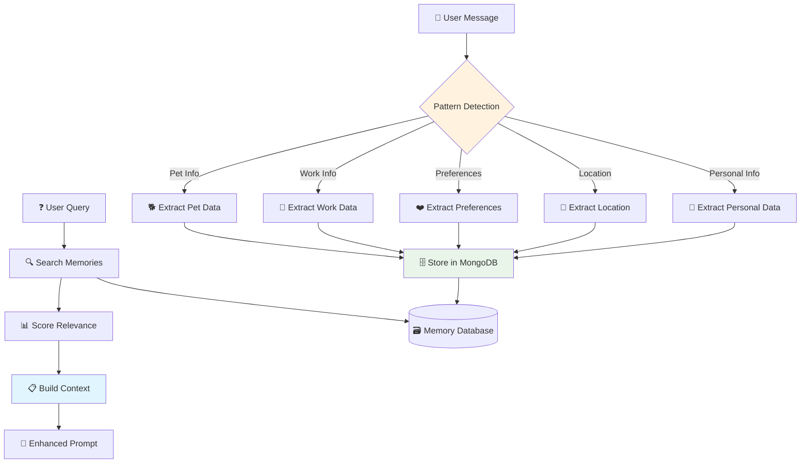
```mermaid
flowchart TD
    A[📝 User Message] --> B{Pattern Detection}
    B -->|Personal Info| C[👤 Extract Personal Data]
    B -->|Location| D[📍 Extract Location]
    B -->|Preferences| E[❤️ Extract Preferences]
    B -->|Work Info| F[💼 Extract Work Data]
    B -->|Pet Info| G[🐕 Extract Pet Data]
    
    C --> H[🗄️ Store in MongoDB]
    D --> H
    E --> H
    F --> H
    G --> H
    
    I[❓ User Query] --> J[🔍 Search Memories]
    J --> K[📊 Score Relevance]
    K --> L[📋 Build Context]
    L --> M[🤖 Enhanced Prompt]
    
    H --> N[(🗃️ Memory Database)]
    J --> N
    
    style B fill:#fff3e0
    style H fill:#e8f5e8
    style L fill:#e1f5fe
```

**Pattern Recognition:**
- Personal information (name, age, etc.)
- Location data (home, work, travel)
- Preferences (food, activities, interests)
- Work/career information
- Pet and family details
- Health and fitness data

### 3. Data Layer

#### MongoDB Database Schema
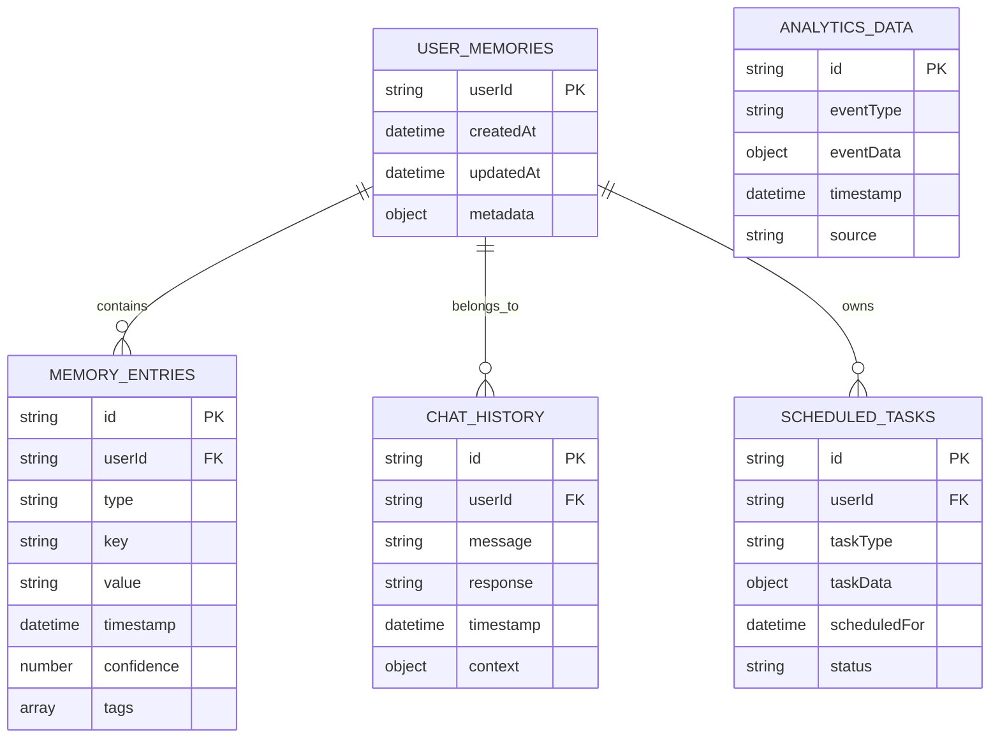
```mermaid
erDiagram
    USER_MEMORIES ||--o{ MEMORY_ENTRIES : contains
    USER_MEMORIES ||--o{ CHAT_HISTORY : belongs_to
    USER_MEMORIES ||--o{ SCHEDULED_TASKS : owns
    
    USER_MEMORIES {
        string userId PK
        datetime createdAt
        datetime updatedAt
        object metadata
    }
    
    MEMORY_ENTRIES {
        string id PK
        string userId FK
        string type
        string key
        string value
        datetime timestamp
        number confidence
        array tags
    }
    
    CHAT_HISTORY {
        string id PK
        string userId FK
        string message
        string response
        datetime timestamp
        object context
    }
    
    SCHEDULED_TASKS {
        string id PK
        string userId FK
        string taskType
        object taskData
        datetime scheduledFor
        string status
    }
    
    ANALYTICS_DATA {
        string id PK
        string eventType
        object eventData
        datetime timestamp
        string source
    }
```

### 4. Infrastructure Layer

#### Deployment Architecture
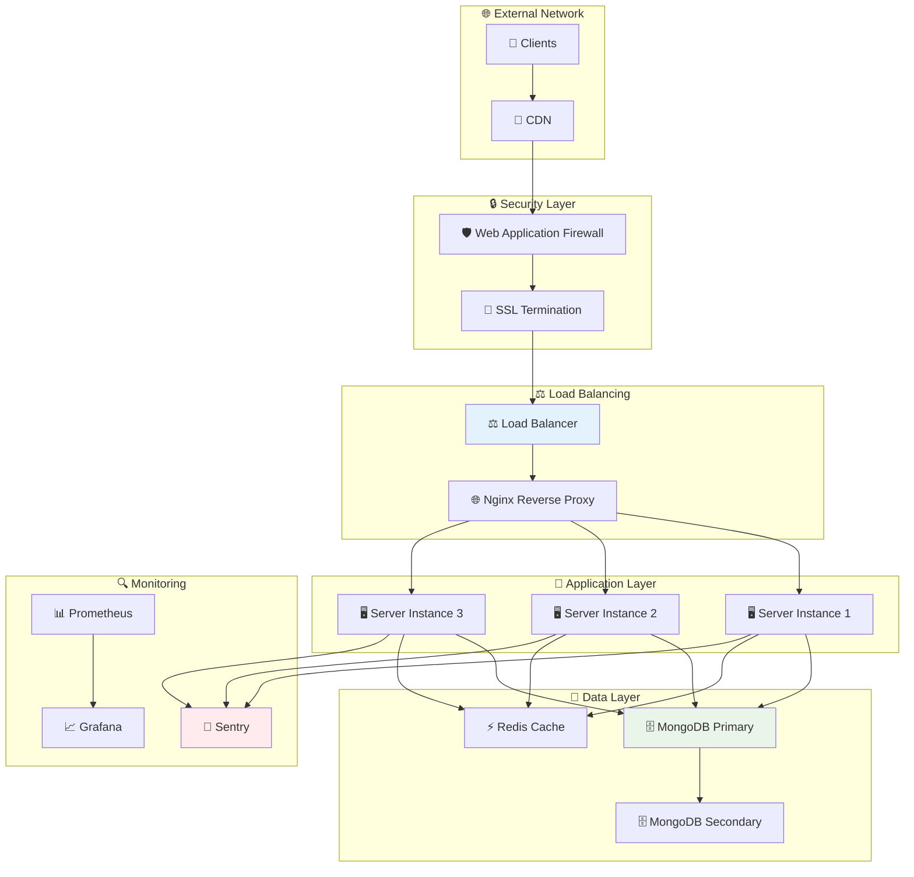
```mermaid
graph TB
    subgraph "🌐 External Network"
        CLIENT[👤 Clients]
        CDN[🚀 CDN]
    end
    
    subgraph "🔒 Security Layer"
        WAF[🛡️ Web Application Firewall]
        SSL[🔐 SSL Termination]
    end
    
    subgraph "⚖️ Load Balancing"
        LB[⚖️ Load Balancer]
        NGINX[🌐 Nginx Reverse Proxy]
    end
    
    subgraph "🚀 Application Layer"
        APP1[🖥️ Server Instance 1]
        APP2[🖥️ Server Instance 2]
        APP3[🖥️ Server Instance 3]
    end
    
    subgraph "💾 Data Layer"
        MONGO_PRIMARY[🗄️ MongoDB Primary]
        MONGO_SECONDARY[🗄️ MongoDB Secondary]
        REDIS[⚡ Redis Cache]
    end
    
    subgraph "🔍 Monitoring"
        SENTRY[🚨 Sentry]
        PROMETHEUS[📊 Prometheus]
        GRAFANA[📈 Grafana]
    end
    
    CLIENT --> CDN
    CDN --> WAF
    WAF --> SSL
    SSL --> LB
    LB --> NGINX
    
    NGINX --> APP1
    NGINX --> APP2
    NGINX --> APP3
    
    APP1 --> MONGO_PRIMARY
    APP2 --> MONGO_PRIMARY
    APP3 --> MONGO_PRIMARY
    
    MONGO_PRIMARY --> MONGO_SECONDARY
    
    APP1 --> REDIS
    APP2 --> REDIS
    APP3 --> REDIS
    
    APP1 --> SENTRY
    APP2 --> SENTRY
    APP3 --> SENTRY
    
    PROMETHEUS --> GRAFANA
    
    style LB fill:#e3f2fd
    style MONGO_PRIMARY fill:#e8f5e8
    style SENTRY fill:#ffebee
```

## 🔄 Data Flow Patterns

### Chat Message Processing
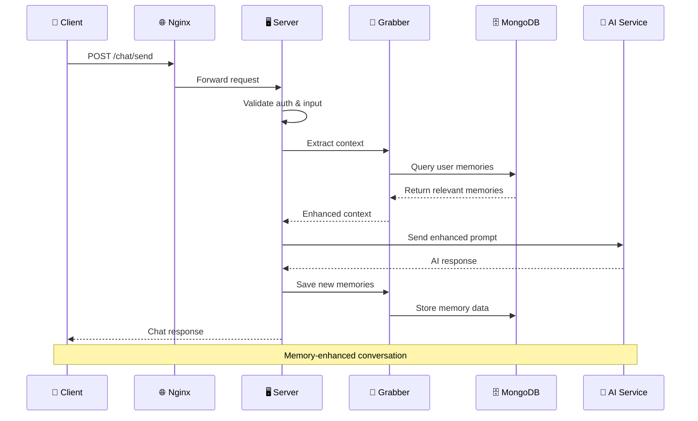
```mermaid
sequenceDiagram
    participant C as 👤 Client
    participant N as 🌐 Nginx
    participant S as 🖥️ Server
    participant G as 🧠 Grabber
    participant M as 🗄️ MongoDB
    participant A as 🤖 AI Service
    
    C->>N: POST /chat/send
    N->>S: Forward request
    S->>S: Validate auth & input
    S->>G: Extract context
    G->>M: Query user memories
    M-->>G: Return relevant memories
    G-->>S: Enhanced context
    S->>A: Send enhanced prompt
    A-->>S: AI response
    S->>G: Save new memories
    G->>M: Store memory data
    S-->>C: Chat response
    
    Note over C,A: Memory-enhanced conversation
```

### Memory Storage Flow
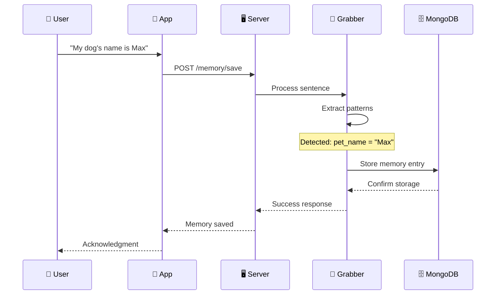
```mermaid
sequenceDiagram
    participant U as 👤 User
    participant A as 📱 App
    participant S as 🖥️ Server
    participant G as 🧠 Grabber
    participant M as 🗄️ MongoDB
    
    U->>A: "My dog's name is Max"
    A->>S: POST /memory/save
    S->>G: Process sentence
    G->>G: Extract patterns
    Note over G: Detected: pet_name = "Max"
    G->>M: Store memory entry
    M-->>G: Confirm storage
    G-->>S: Success response
    S-->>A: Memory saved
    A-->>U: Acknowledgment
```

## 🚀 Deployment Strategies

### Development Environment
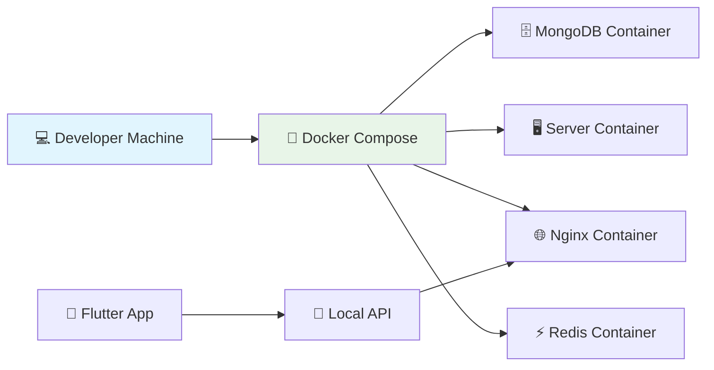
```mermaid
graph LR
    A[💻 Developer Machine] --> B[🐳 Docker Compose]
    B --> C[🗄️ MongoDB Container]
    B --> D[🖥️ Server Container]
    B --> E[🌐 Nginx Container]
    B --> F[⚡ Redis Container]
    
    G[📱 Flutter App] --> H[🔗 Local API]
    H --> E
    
    style A fill:#e1f5fe
    style B fill:#e8f5e8
```

### Production Environment
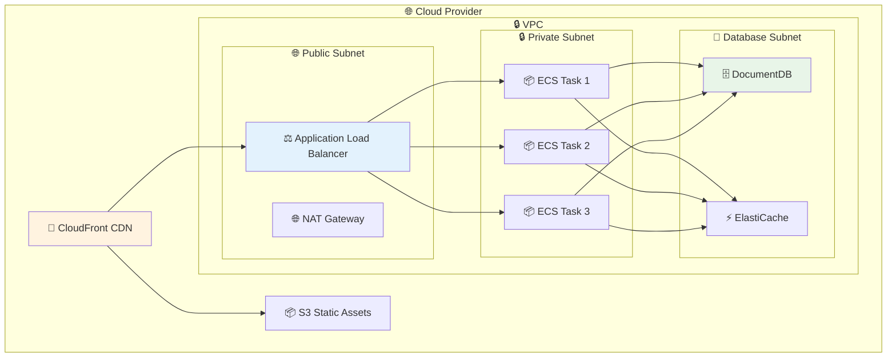
```mermaid
graph TB
    subgraph "🌐 Cloud Provider"
        subgraph "🔒 VPC"
            subgraph "🌐 Public Subnet"
                ALB[⚖️ Application Load Balancer]
                NAT[🌐 NAT Gateway]
            end
            
            subgraph "🔒 Private Subnet"
                ECS1[📦 ECS Task 1]
                ECS2[📦 ECS Task 2]
                ECS3[📦 ECS Task 3]
            end
            
            subgraph "💾 Database Subnet"
                DOCDB[🗄️ DocumentDB]
                REDIS[⚡ ElastiCache]
            end
        end
        
        CDN[🚀 CloudFront CDN]
        S3[📦 S3 Static Assets]
    end
    
    CDN --> ALB
    ALB --> ECS1
    ALB --> ECS2
    ALB --> ECS3
    
    ECS1 --> DOCDB
    ECS2 --> DOCDB
    ECS3 --> DOCDB
    
    ECS1 --> REDIS
    ECS2 --> REDIS
    ECS3 --> REDIS
    
    CDN --> S3
    
    style ALB fill:#e3f2fd
    style DOCDB fill:#e8f5e8
    style CDN fill:#fff3e0
```

## 🔧 Configuration Management

### Environment-Based Configuration
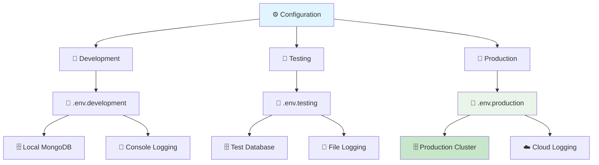
```mermaid
graph TD
    A[⚙️ Configuration] --> B[🔧 Development]
    A --> C[🧪 Testing]
    A --> D[🚀 Production]
    
    B --> E[📝 .env.development]
    C --> F[📝 .env.testing]
    D --> G[📝 .env.production]
    
    E --> H[🗄️ Local MongoDB]
    F --> I[🗄️ Test Database]
    G --> J[🗄️ Production Cluster]
    
    E --> K[🚨 Console Logging]
    F --> L[📄 File Logging]
    G --> M[☁️ Cloud Logging]
    
    style A fill:#e1f5fe
    style G fill:#e8f5e8
    style J fill:#c8e6c9
```

### Service Discovery
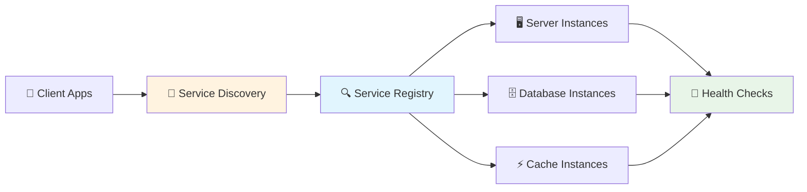
```mermaid
graph LR
    A[🔍 Service Registry] --> B[🖥️ Server Instances]
    A --> C[🗄️ Database Instances]
    A --> D[⚡ Cache Instances]
    
    E[📱 Client Apps] --> F[🔗 Service Discovery]
    F --> A
    
    B --> G[💚 Health Checks]
    C --> G
    D --> G
    
    style A fill:#e1f5fe
    style F fill:#fff3e0
    style G fill:#e8f5e8
```

## 📊 Performance Considerations

### Scaling Strategies
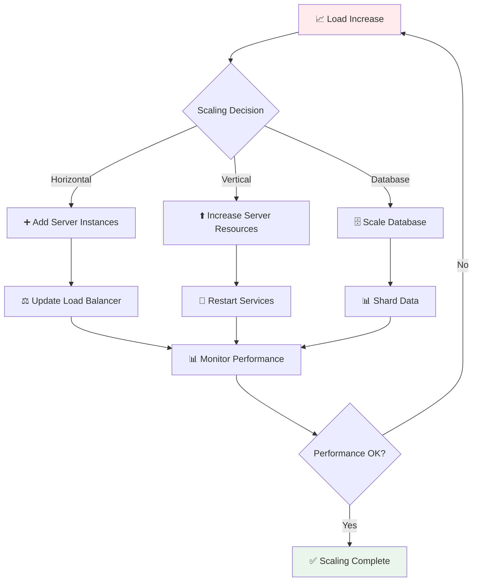
```mermaid
graph TD
    A[📈 Load Increase] --> B{Scaling Decision}
    B -->|Horizontal| C[➕ Add Server Instances]
    B -->|Vertical| D[⬆️ Increase Server Resources]
    B -->|Database| E[🗄️ Scale Database]
    
    C --> F[⚖️ Update Load Balancer]
    D --> G[🔄 Restart Services]
    E --> H[📊 Shard Data]
    
    F --> I[📊 Monitor Performance]
    G --> I
    H --> I
    
    I --> J{Performance OK?}
    J -->|No| A
    J -->|Yes| K[✅ Scaling Complete]
    
    style A fill:#ffebee
    style K fill:#e8f5e8
```

### Caching Strategy
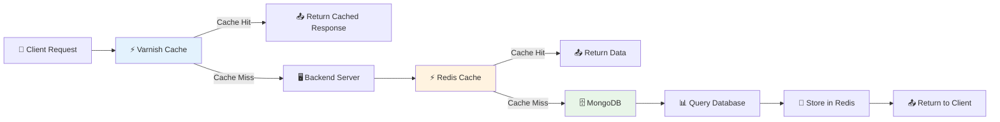
```mermaid
graph LR
    A[📱 Client Request] --> B[⚡ Varnish Cache]
    B -->|Cache Hit| C[📤 Return Cached Response]
    B -->|Cache Miss| D[🖥️ Backend Server]
    
    D --> E[⚡ Redis Cache]
    E -->|Cache Hit| F[📤 Return Data]
    E -->|Cache Miss| G[🗄️ MongoDB]
    
    G --> H[📊 Query Database]
    H --> I[💾 Store in Redis]
    I --> J[📤 Return to Client]
    
    style B fill:#e3f2fd
    style E fill:#fff3e0
    style G fill:#e8f5e8
```

## 🔐 Security Architecture

### Authentication & Authorization
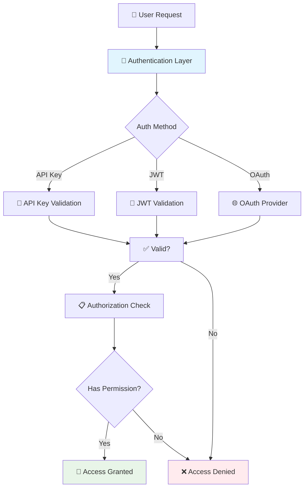
```mermaid
graph TD
    A[👤 User Request] --> B[🔐 Authentication Layer]
    B --> C{Auth Method}
    
    C -->|API Key| D[🔑 API Key Validation]
    C -->|JWT| E[🎫 JWT Validation]
    C -->|OAuth| F[🌐 OAuth Provider]
    
    D --> G[✅ Valid?]
    E --> G
    F --> G
    
    G -->|Yes| H[📋 Authorization Check]
    G -->|No| I[❌ Access Denied]
    
    H --> J{Has Permission?}
    J -->|Yes| K[🎯 Access Granted]
    J -->|No| I
    
    style B fill:#e1f5fe
    style K fill:#e8f5e8
    style I fill:#ffebee
```

### Data Protection
```mermaid
graph LR
    A[📝 User Data] --> B[🔒 Encryption at Rest]
    A --> C[🔐 Encryption in Transit]
    
    B --> D[🗄️ Encrypted Database]
    C --> E[🔐 TLS/SSL]
    
    F[🔑 Key Management] --> B
    F --> C
    
    G[🛡️ Access Controls] --> D
    G --> E
    
    H[📊 Audit Logging] --> I[📄 Security Logs]
    
    style B fill:#e8f5e8
    style C fill:#e3f2fd
    style F fill:#fff3e0
```

## 🔍 Monitoring & Observability

### Monitoring Stack
```mermaid
graph TB
    subgraph "📊 Metrics Collection"
        A[📈 Application Metrics]
        B[🖥️ System Metrics]
        C[🗄️ Database Metrics]
    end
    
    subgraph "📋 Logging"
        D[📄 Application Logs]
        E[🌐 Access Logs]
        F[🚨 Error Logs]
    end
    
    subgraph "🔍 Tracing"
        G[🔗 Request Tracing]
        H[📊 Performance Tracing]
    end
    
    A --> I[📊 Prometheus]
    B --> I
    C --> I
    
    D --> J[📋 Log Aggregation]
    E --> J
    F --> J
    
    G --> K[🔍 Jaeger]
    H --> K
    
    I --> L[📈 Grafana]
    J --> M[🔍 ELK Stack]
    K --> N[📊 Tracing UI]
    
    style I fill:#e8f5e8
    style L fill:#e1f5fe
    style M fill:#fff3e0
```

This architecture provides a robust, scalable foundation for Roommate's intelligent assistant capabilities while maintaining security, performance, and maintainability standards.