# Getting Started with Roommate

Welcome to Roommate! This guide will help you get up and running quickly with your intelligent assistant system.

## 🚀 Quick Start

The fastest way to get Roommate running is using our automated setup script:

```bash
# Clone the repository
git clone https://github.com/TheusHen/roommate.git
cd roommate

# Run the automated setup
./scripts/start/run.sh
```

This script will automatically:
- ✅ Check and install all required dependencies
- ✅ Set up SSL certificates for HTTPS deployment
- ✅ Configure environment variables
- ✅ Start all services (MongoDB, Server, Analytics)
- ✅ Launch the web interface

## 📋 Prerequisites

Before starting, ensure your system meets these requirements:

### System Requirements
- **Operating System**: Linux, macOS, or Windows (with WSL2)
- **RAM**: Minimum 4GB, recommended 8GB+
- **Storage**: At least 2GB free space
- **Network**: Internet connection for dependency installation

### Required Software
- **Python 3.11+**
- **Node.js 20+**
- **Bun runtime**
- **Flutter 3.24+**
- **PHP 8.2+**
- **MongoDB 6.0+**
- **Docker** (optional, for containerized deployment)

## 🏗️ Installation Flow

```mermaid
graph TD
    A[📥 Clone Repository] --> B{Choose Installation Method}
    B -->|Recommended| C[🚀 Automated Setup]
    B -->|Alternative| D[🐳 Docker Setup]
    B -->|Advanced| E[⚙️ Manual Setup]
    
    C --> F[📋 Check Dependencies]
    D --> G[🐳 Pull Docker Images]
    E --> H[📦 Install Dependencies Manually]
    
    F --> I[🔧 Configure Environment]
    G --> I
    H --> I
    
    I --> J[🗄️ Start MongoDB]
    J --> K[🖥️ Start Server]
    K --> L[📱 Launch App]
    L --> M[✅ System Ready]
    
    style C fill:#e8f5e8
    style D fill:#e3f2fd
    style E fill:#fff3e0
    style M fill:#c8e6c9
```



## 📱 First Time Setup

### 1. Choose Your Deployment Mode

When you run `./scripts/start/run.sh`, you'll be prompted to choose:

- **HTTPS (Recommended)** - Secure production deployment with SSL certificates
- **HTTP** - Local development and testing
- **Local Only** - No external access, localhost only

### 2. Access the Application

After setup completes, you can access Roommate through:

#### Web Interface
```bash
# HTTPS mode
https://your-domain.com

# HTTP mode  
http://localhost:8080

# Local mode
http://localhost:3000
```

#### Flutter Mobile App
```bash
cd app && flutter run
```

#### API Endpoints
```bash
# Test the API
curl -X POST http://localhost:3000/chat/send \
  -H "Content-Type: application/json" \
  -H "Authorization: Bearer YOUR_API_PASSWORD" \
  -d '{"message": "Hello Roommate!", "userId": "user-123"}'
```

## 🎯 Basic Usage Examples

### Chat Interaction
```http
POST /chat/send
Content-Type: application/json
Authorization: Bearer YOUR_API_PASSWORD

{
  "message": "What's the weather like?",
  "userId": "user-123"
}
```

### Save User Memory
```http
POST /memory/save
Content-Type: application/json
Authorization: Bearer YOUR_API_PASSWORD

{
  "userId": "user-123",
  "sentence": "My favorite color is blue"
}
```

### Retrieve User Memory
```http
GET /memory/get?userId=user-123&prompt=What is my favorite color?
Authorization: Bearer YOUR_API_PASSWORD
```

## 🔧 Configuration

### Environment Variables

Key configuration options in your `.env` file:

```env
# Database
MONGODB_URI=mongodb://localhost:27017/roommate

# Server
PORT=3000
API_PASSWORD=your-secure-password

# Features
ENABLE_VOICE=true
ENABLE_IOT=true
ENABLE_ANALYTICS=true

# Error Tracking
SENTRY_DSN=your-sentry-dsn
NIGHTWATCH_ENABLED=true
```

### Service Configuration

```mermaid
graph LR
    A[📝 Environment Config] --> B[🗄️ MongoDB]
    A --> C[🖥️ Server]
    A --> D[📊 Analytics]
    A --> E[🔍 Monitoring]
    
    B --> F[💾 Memory Storage]
    C --> G[🔌 API Endpoints]
    D --> H[📈 Usage Metrics]
    E --> I[🚨 Error Tracking]
    
    style A fill:#e1f5fe
    style F fill:#e8f5e8
    style G fill:#fff3e0
    style H fill:#f3e5f5
    style I fill:#ffebee
```



## 🧪 Verify Installation

Test your installation with these commands:

```bash
# Run all tests
./run-tests.sh

# Test specific components
cd server && bun test
cd mongodb && bun test
cd app && flutter test

# Check service health
curl http://localhost:3000/health
```

## 🎓 Next Steps

Once you have Roommate running, explore these features:

1. **📖 Learn the Basics** - Check out [basic_tutorial.ipynb](basic_tutorial.ipynb)
2. **🧠 Explore Memory System** - See [memory_tutorial.ipynb](memory_tutorial.ipynb)
3. **🏠 Set up IoT Integration** - Follow [iot_tutorial.ipynb](iot_tutorial.ipynb)
4. **🔧 Advanced Configuration** - Read [advanced_installation.md](advanced_installation.md)
5. **🐛 Troubleshooting** - Consult [troubleshooting.md](troubleshooting.md)

## 🆘 Getting Help

If you encounter issues:

1. **Check the logs** - Look for error messages in the console output
2. **Run diagnostics** - Use `./scripts/validate_fixes.sh`
3. **Consult documentation** - See [FAQ](faq.md) and [Troubleshooting](troubleshooting.md)
4. **Community support** - Open an issue on [GitHub](https://github.com/TheusHen/roommate/issues)

## 🎉 Welcome to Roommate!

You're now ready to start using Roommate! The system combines powerful memory capabilities, cross-platform support, and intelligent conversation to create your personal AI assistant.

Explore the interactive tutorials and documentation to discover all the features available to you.